# Wiki Documentation for https://github.com/LazyAGI/LazyLLM

Generated on: 2025-07-21 01:42:14

## Table of Contents

- [项目简介](#page-1)
- [快速入门](#page-2)
- [系统架构图](#page-3)
- [模块与组件关系](#page-4)
- [流程构建（Flow）](#page-5)
- [RAG 支持](#page-6)
- [模型微调与部署](#page-7)
- [本地模型支持](#page-8)
- [在线模型支持](#page-9)
- [部署流程](#page-10)
- [跨平台支持](#page-11)

<a id='page-1'></a>

## 项目简介

### Related Pages

Related topics: [快速入门](#page-2)

<details>
<summary>Relevant source files</summary>

The following files were used as context for generating this wiki page:

- [README.md](https://github.com/LazyAGI/LazyLLM/blob/main/README.md)
- [README.CN.md](https://github.com/LazyAGI/LazyLLM/blob/main/README.CN.md)
- [examples/story_online.py](https://github.com/LazyAGI/LazyLLM/blob/main/examples/story_online.py)
- [tests/charge_tests/test_engine.py](https://github.com/LazyAGI/LazyLLM/blob/main/tests/charge_tests/test_engine.py)
- [lazyllm/tools/rag/transform.py](https://github.com/LazyAGI/LazyLLM/blob/main/lazyllm/tools/rag/transform.py)
- [examples/story.py](https://github.com/LazyAGI/LazyLLM/blob/main/examples/story.py)
- [lazyllm/components/deploy/base.py](https://github.com/LazyAGI/LazyLLM/blob/main/lazyllm/components/deploy/base.py)
- [lazyllm/module/llms/trainablemodule.py](https://github.com/LazyAGI/LazyLLM/blob/main/lazyllm/module/llms/trainablemodule.py)
- [lazyllm/engine/engine.py](https://github.com/LazyAGI/LazyLLM/blob/main/lazyllm/engine/engine.py)
</details>

# 项目简介

## 一、项目概述

LazyLLM是一款低代码构建**多Agent**大模型应用的开发工具，协助开发者用极低的成本构建复杂的AI应用，并可以持续的迭代优化效果。LazyLLM提供了便捷的搭建应用的workflow，并且为应用开发过程中的各个环节提供了大量的标准流程和工具。

LazyLLM的核心设计理念是"原型搭建 -> 数据回流 -> 迭代优化"的流程，即用户可以先基于LazyLLM快速跑通应用的原型，再结合场景任务数据进行bad-case分析，然后对应用中的关键环节进行算法迭代和模型微调，进而逐步提升整个应用的效果。

LazyLLM不仅适用于初级开发者，也适用于资深专家。对于初级开发者，LazyLLM彻底简化了AI应用的开发过程，他们无需了解API服务的构建细节，也不需要掌握Web开发知识。对于资深专家，LazyLLM提供了极高的灵活性，每个模块都支持定制和扩展。

## 二、核心特性

### 便捷的AI应用组装流程

LazyLLM提供了pipeline、parallel、diverter、if、switch、loop等工作流(Flow)，开发者可以基于任意的函数和模块来快速搭建多Agent的AI应用。支持对组装好的多Agent应用进行一键部署，也支持对应用进行部分或者全部的更新。

```python
with pipeline() as ppl:
    ppl.outline_writer = lazyllm.TrainableModule('internlm2-chat-7b').formatter(JsonFormatter()).prompt(toc_prompt)
    ppl.story_generater = warp(ppl.outline_writer.share(prompt=writer_prompt).formatter())
    ppl.synthesizer = (lambda *storys, outlines: "\n".join([f"{o['title']}\n{s}" for s, o in zip(storys, outlines)])) | bind(outlines=ppl.output('outline_writer'))
lazyllm.WebModule(ppl, port=23466).start().wait()
```

Sources: [examples/story.py](), [README.CN.md]()

### 跨平台兼容

LazyLLM支持用户在不同的算力平台上获得一致的使用体验。目前兼容裸金属、Slurm、SenseCore等多种算力平台。这使得开发中的应用可以无缝迁移到其他IaaS平台，大大减少了代码修改的工作量。

Sources: [README.CN.md]()

### 支持大模型的微调和推理

LazyLLM支持离线(本地)模型服务和在线服务两种模式：

| 模式 | 支持框架 | 支持模型 |
|------|---------|---------|
| 离线服务 | collie、peft | internlm2-chat-7b、stable-diffusion-3-medium |
| 在线服务 | GPT、SenseNova、Kimi、智谱、通义千问 | glm-4、gpt-3.5-turbo、moonshot-v1-8k、qwen-plus、SenseChat-5 |

Sources: [README.CN.md](), [examples/story.py]()

### 支持RAG常用组件

LazyLLM支持RAG常用组件，包括Document、Parser、Retriever、Reranker等。

```python
documents = Document(dataset_path='/file/to/yourpath', embed=lazyllm.TrainableModule('bge-large-zh-v1.5'))
documents.create_node_group(name="sentences", transform=SentenceSplitter, chunk_size=1024, chunk_overlap=100)
```

Sources: [README.CN.md](), [lazyllm/tools/rag/transform.py]()

### 基础的界面支持

LazyLLM提供了基础的界面支持，如聊天界面、文档管理界面等。

```python
lazyllm.WebModule(ppl, port=23466).start().wait()
```

Sources: [examples/story.py]()

## 三、架构设计

### 整体架构

LazyLLM的整体架构包括Component、Module、Flow等核心组件。


Sources: [README.CN.md]()

### Component

Component是LazyLLM中最小的执行单元，它既可以是一个函数，也可以是一个bash命令。Component具备三个典型的能力：

1. 能借助launcher，实现用户无感的跨平台
2. 利用注册机制，实现方法的分组索引和快速查找
3. 支持对函数和bash命令进行注册

```python
@lazyllm.component_register('demo')
def test(input):
    return f'input is {input}'
```

Sources: [README.CN.md]()

### Module

Module是LazyLLM中的顶层组件，具备训练、部署、推理和评测四项关键能力。

| 类型 | 作用 | 训练/微调 | 部署 | 推理 | 评测 |
|------|-----|-----------|------|------|------|
| ActionModule | 可以将函数、模块、flow等包装成一个Module | 支持 | 支持 | ✅ | ✅ |
| UrlModule | 将任意Url包装成Module，用于访问外部服务 | ❌ | ❌ | ✅ | ✅ |

Sources: [README.CN.md]()

### Flow

Flow定义了pipeline、parallel、diverter、if、switch、loop等工作流。

```python
with pipeline() as ppl:
    with parallel().sum as ppl.prl:
        prl.retriever1 = Retriever(documents, group_name="sentences", similarity="cosine", topk=3)
        prl.retriever2 = Retriever(documents, "CoarseChunk", "bm25_chinese", 0.003, topk=3)
```

Sources: [README.CN.md](), [examples/story.py]()

## 四、使用场景

### 对话机器人

```python
chat = lazyllm.OnlineChatModule()
lazyllm.WebModule(chat).start().wait()
```

Sources: [README.CN.md]()

### 检索增强生成

```python
documents = Document(dataset_path="file/to/yourpath", embed=lazyllm.OnlineEmbeddingModule(), manager=False)
documents.create_node_group(name="sentences", transform=SentenceSplitter, chunk_size=1024, chunk_overlap=100)
```

Sources: [README.CN.md]()

### 故事创作

```python
with pipeline() as ppl:
    ppl.outline_writer = lazyllm.OnlineChatModule(stream=False).formatter(JsonFormatter()).prompt(toc_prompt)
    ppl.story_generater = warp(lazyllm.OnlineChatModule(stream=False).prompt(writer_prompt))
    ppl.synthesizer = (lambda *storys, outlines: "\n".join([f"{o['title']}\n{s}" for s, o in zip(storys, outlines)])) | bind(outlines=ppl.output('outline_writer'))
```

Sources: [examples/story_online.py](), [examples/story.py]()

### AI绘画助手

```python
with pipeline() as ppl:
    ppl.llm = lazyllm.TrainableModule('internlm2-chat-7b').prompt(lazyllm.ChatPrompter(prompt))
    ppl.sd3 = lazyllm.TrainableModule('stable-diffusion-3-medium')
```

Sources: [README.CN.md](), [examples/story.py]()

## 五、安装与部署

### 源码安装

```bash
git clone git@github.com:LazyAGI/LazyLLM.git
cd LazyLLM
pip install -r requirements.txt
```

如果想进行微调、推理部署或搭建rag应用等，则需使用 `pip install -r requirements.full.txt`

### pip安装

仅安装lazyllm及必要的依赖，可以使用
```bash
pip3 install lazyllm
```

安装lazyllm及所有的依赖，可以使用
```bash
pip3 install lazyllm
lazyllm install full
```

Sources: [README.CN.md]()

## 六、总结

LazyLLM是一款功能强大且易于使用的AI应用开发工具，它通过提供低代码的开发方式，帮助开发者快速构建复杂的AI应用。无论是初级开发者还是资深专家，都能在LazyLLM中找到适合自己的开发方式。LazyLLM的设计理念是"快速原型搭建，结合场景任务数据进行bad-case分析，针对关键环节进行算法尝试和模型微调"，这一理念贯穿于整个项目的设计和实现中。

---

<a id='page-2'></a>

## 快速入门

### Related Pages

Related topics: [项目简介](#page-1), [部署流程](#page-10)

<details>
<summary>Relevant source files</summary>

- [README.md](https://github.com/LazyAGI/LazyLLM/blob/main/README.md)
- [README.CN.md](https://github.com/LazyAGI/LazyLLM/blob/main/README.CN.md)
- [examples/chatbot.py](https://github.com/LazyAGI/LazyLLM/blob/main/examples/chatbot.py)
- [examples/rag.py](https://github.com/LazyAGI/LazyLLM/blob/main/examples/rag.py)
- [lazyllm/cli/run.py](https://github.com/LazyAGI/LazyLLM/blob/main/lazyllm/cli/run.py)
</details>

# 快速入门

LazyLLM是一款低代码构建多Agent大模型应用的开发工具，协助开发者用极低的成本构建复杂的AI应用，并可以持续的迭代优化效果。LazyLLM提供了便捷的搭建应用的workflow，并且为应用开发过程中的各个环节提供了大量的标准流程和工具。基于LazyLLM的AI应用构建流程是原型搭建 -> 数据回流 -> 迭代优化，即您可以先基于LazyLLM快速跑通应用的原型，再结合场景任务数据进行bad-case分析，然后对应用中的关键环节进行算法迭代和模型微调，进而逐步提升整个应用的效果。

## 安装与配置

### 安装步骤

```bash
pip3 install lazyllm
lazyllm install full
```

### 环境变量设置

在运行LazyLLM之前，需要设置相应的环境变量，例如API密钥。例如，如果您使用的是Zhipu AI的API，需要设置`LAZYLLM_GLM_API_KEY`环境变量：

```bash
export LAZYLLM_GLM_API_KEY=xxxx
```

## 快速启动

### 对话机器人

这是一个简单的对话机器人示例：

```python
import lazyllm
chat = lazyllm.OnlineChatModule()
lazyllm.WebModule(chat).start().wait()
```

如果您想使用一个本地部署的模型，请确保自己安装了至少一个推理框架(lightllm或vllm)，然后代码如下：

```python
import lazyllm
chat = lazyllm.TrainableModule('internlm2-chat-7b')
lazyllm.WebModule(chat, port=23466).start().wait()
```

如果您是使用 `pip` 安装的 `lazyllm` ，并且保证python环境的`bin`目录已经在`$PATH`中，则你可以通过执行 `lazyllm run chatbot` 来快速启动一个对话机器人。如果你想使用本地模型，则需要用`--model`参数指定模型名称，例如你可以用`lazyllm run chatbot --model=internlm2-chat-7b` 来启动基于本地模型的对话机器人。

### 检索增强生成

这是一个在线部署示例：

```python
documents = Document(dataset_path="file/to/yourpath", embed=lazyllm.OnlineEmbeddingModule(), manager=False)
documents.create_node_group(name="sentences", transform=SentenceSplitter, chunk_size=1024, chunk_overlap=100)
with pipeline() as ppl:
    with parallel().sum as ppl.prl:
        prl.retriever1 = Retriever(documents, group_name="sentences", similarity="cosine", topk=3)
        prl.retriever2 = Retriever(documents, "CoarseChunk", "bm25_chinese", 0.003, topk=3)

    ppl.reranker = Reranker("ModuleReranker", model="bge-reranker-large", topk=1) | bind(query=ppl.input)
    ppl.formatter = (lambda nodes, query: dict(context_str="".join([node.get_content() for node in nodes]), query=query)) | bind(query=ppl.input)
    ppl.llm = lazyllm.OnlineChatModule(stream=False).prompt(lazyllm.ChatPrompter(prompt, extra_keys=["context_str"]))

lazyllm.WebModule(ppl, port=23466).start().wait()
```

这是一个本地部署示例：

```python
documents = Document(dataset_path='/file/to/yourpath', embed=lazyllm.TrainableModule('bge-large-zh-v1.5'))
documents.create_node_group(name="sentences", transform=SentenceSplitter, chunk_size=1024, chunk_overlap=100)

with pipeline() as ppl:
    with parallel().sum as ppl.prl:
        prl.retriever1 = Retriever(documents, group_name="sentences", similarity="cosine", topk=3)
        prl.retriever2 = Retriever(documents, "CoarseChunk", "bm25_chinese", 0.003, topk=3)

    ppl.reranker = Reranker("ModuleReranker", model="bge-reranker-large", topk=1) | bind(query=ppl.input)
    ppl.formatter = (lambda nodes, query: dict(context_str="".join([node.get_content() for node in nodes]), query=query)) | bind(query=ppl.input)
    ppl.llm = lazyllm.TrainableModule("internlm2-chat-7b").prompt(lazyllm.ChatPrompter(prompt, extra_keys=["context_str"]))

lazyllm.WebModule(ppl, port=23456).start().wait()
```

如果您是使用 `pip` 安装的 `lazyllm` ，并且保证python环境的`bin`目录已经在`$PATH`中，则你可以通过执行 `lazyllm run rag --documents=/file/to/yourpath` 来快速启动一个检索增强机器人。如果你想使用本地模型，则需要用`--model`参数指定模型名称，例如你可以用`lazyllm run rag --documents=/file/to/yourpath --model=internlm2-chat-7b` 来启动基于本地模型的检索增强机器人。

## 架构与组件

### 架构图

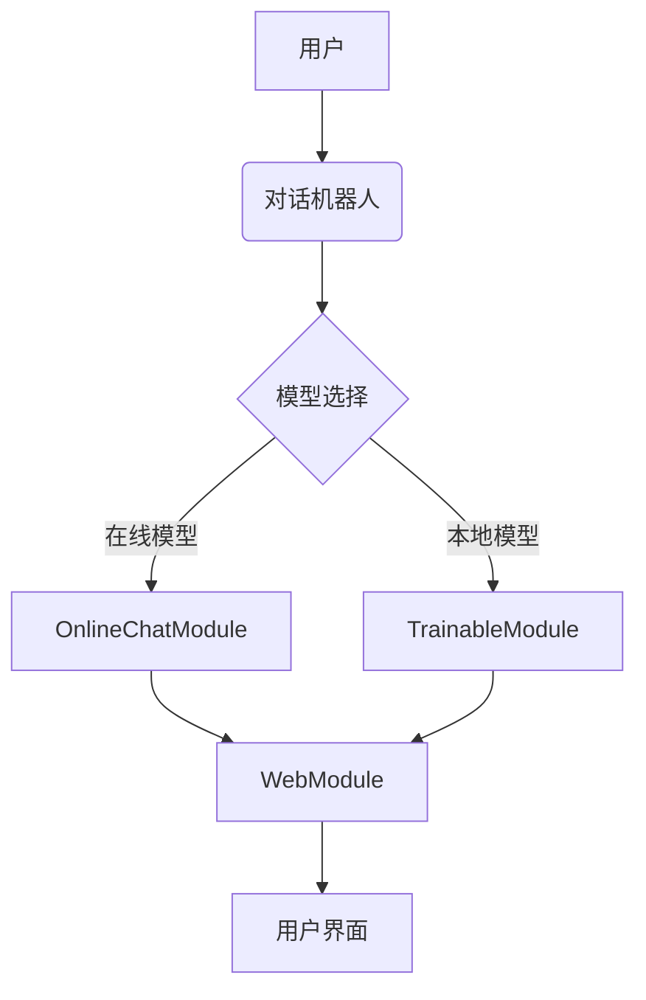

### 组件说明

- **OnlineChatModule**: 用于与在线模型进行交互，如OpenAI、SenseNova、Kimi、ChatGLM等。
- **TrainableModule**: 用于与本地模型进行交互，支持模型的微调和训练。
- **WebModule**: 提供了一个Web界面，用于与模型进行交互。
- **Document**: 用于处理文档数据，支持文档的切分和索引。
- **Retriever**: 用于从文档中检索相关信息。
- **Reranker**: 用于对检索结果进行重新排序，提高检索效果。
- **Pipeline**: 用于构建处理流程，支持多个处理步骤的组合。

### 模型选择

LazyLLM支持多种模型，包括在线模型和本地模型。在线模型包括OpenAI、SenseNova、Kimi、ChatGLM等，本地模型包括internlm2-chat-7b、bge-large-zh-v1.5等。用户可以根据自己的需求选择合适的模型。

### 数据处理

LazyLLM提供了强大的数据处理功能，包括文档的切分、索引和检索。用户可以使用SentenceSplitter对文档进行切分，使用Retriever从文档中检索相关信息，使用Reranker对检索结果进行重新排序。

### 一键部署

LazyLLM提供了一键部署所有模块的能力。在POC阶段，LazyLLM通过一套轻量的网关机制，简化了多Agent应用的部署流程，解决了依次启动各个子模块（如LLM、Embedding等）服务并配置URL的问题，使整个过程更加顺畅高效。而在应用的发布阶段，LazyLLM则提供了一键封装镜像的能力，使得应用可以方便地利用k8s的网关、负载均衡、容错等能力。

### 跨平台兼容

LazyLLM无需修改代码，即可一键切换IaaS平台，目前兼容裸金属服务器、开发机、Slurm集群、公有云等。这使得开发中的应用可以无缝迁移到其他IaaS平台，大大减少了代码修改的工作量。

### 参数优化

LazyLLM支持网格搜索参数优化，根据用户配置，自动尝试不同的基模型、召回策略和微调参数，对应用进行评测和优化。这使得超参数调优过程无需对应用代码进行大量侵入式修改，提高了调优效率，帮助用户快速找到最佳配置。

### 模型微调

LazyLLM支持对应用中的模型进行微调，持续提升应用效果。根据微调场景，自动选择最佳的微调框架和模型切分策略。这不仅简化了模型迭代的维护工作，还让算法研究员能够将更多精力集中在算法和数据迭代上，而无需处理繁琐的工程化任务。

## 总结

LazyLLM是一款功能强大的低代码构建多Agent大模型应用的开发工具，提供了便捷的搭建应用的workflow，并且为应用开发过程中的各个环节提供了大量的标准流程和工具。通过LazyLLM，开发者可以快速构建复杂的AI应用，并持续迭代优化效果。LazyLLM支持多种模型，包括在线模型和本地模型，提供了强大的数据处理功能，支持文档的切分、索引和检索。LazyLLM还提供了一键部署所有模块的能力，简化了多Agent应用的部署流程，并支持跨平台兼容，使得开发中的应用可以无缝迁移到其他IaaS平台。LazyLLM还支持网格搜索参数优化和模型微调，帮助用户快速找到最佳配置，持续提升应用效果。

Sources: [README.md](), [README.CN.md](), [examples/chatbot.py](), [examples/rag.py](), [lazyllm/cli/run.py]()

---

<a id='page-3'></a>

## 系统架构图

### Related Pages

Related topics: [模块与组件关系](#page-4)

<details>
<summary>相关源文件</summary>

- [README.CN.md](https://github.com/LazyAGI/LazyLLM/blob/main/README.CN.md)
- [docs/assets/Architecture.png](https://github.com/LazyAGI/LazyLLM/blob/main/docs/assets/Architecture.png)
- [docs/assets/Architecture.en.png](https://github.com/LazyAGI/LazyLLM/blob/main/docs/assets/Architecture.en.png)
- [lazyllm/module/llms/trainablemodule.py](https://github.com/LazyAGI/LazyLLM/blob/main/lazyllm/module/llms/trainablemodule.py)
- [lazyllm/engine/engine.py](https://github.com/LazyAGI/LazyLLM/blob/main/lazyllm/engine/engine.py)
</details>

# 系统架构图

## 简介

LazyLLM 是一个用于低代码构建多 Agent 大模型应用的开发工具，其核心目标是帮助开发者用极低的成本构建复杂的 AI 应用，并支持持续迭代优化。系统架构图展示了 LazyLLM 的整体结构，包括其核心模块、组件、工作流以及与外部服务的交互方式。通过系统架构图，开发者可以快速理解 LazyLLM 的设计原理、模块职责及其协同方式。

系统架构图主要由以下几个核心部分组成：

- **用户接口层**：提供 Web UI、CLI 和 API 接口，支持用户交互和应用部署。
- **工作流引擎**：包括 Pipeline、Parallel、Diverter 等 Flow 模块，用于定义和执行多 Agent 任务。
- **模块管理**：涵盖 TrainableModule、OnlineChatModule、UrlModule 等模块，支持本地和在线模型的训练、推理、部署和评测。
- **部署与调度**：支持本地、Slurm、SenseCore 等平台的部署，确保跨平台兼容性。
- **数据处理与 RAG 支持**：包括 Document、Retriever、Reranker 等组件，用于构建检索增强生成（RAG）应用。

## 系统架构图详解

### 用户接口层

用户接口层主要负责与用户的交互，包括 Web UI、CLI 和 API 接口。通过 Web UI，用户可以方便地配置和运行 AI 应用；CLI 提供了命令行工具，支持快速启动和管理应用；API 接口则允许开发者通过编程方式调用 LazyLLM 的功能。

#### CLI 启动流程

CLI 工具 `lazyllm run` 支持多种模式，包括 `chatbot`、`rag`、`training_service` 和 `infer_service`，允许用户通过命令行快速启动应用。

```python
def chatbot(llm):
    lazyllm.WebModule(llm, port=range(20000, 25000)).start().wait()

def rag(llm, docpath):
    prompt = ('You will play the role of an AI Q&A assistant and complete a dialogue task. In this '
              'task, you need to provide your answer based on the given context and question.')

    documents = Document(dataset_path=docpath, embed=lazyllm.OnlineEmbeddingModule(), manager=False)
    documents.create_node_group(name="sentences", transform=SentenceSplitter, chunk_size=1024, chunk_overlap=100)

    with pipeline() as ppl:
        with parallel().sum as ppl.prl:
            ppl.prl.retriever1 = Retriever(documents, group_name="sentences", similarity="cosine", topk=3)
            ppl.prl.retriever2 = Retriever(documents, "CoarseChunk", "bm25_chinese", 0.003, topk=3)

        ppl.reranker = Reranker("ModuleReranker", model="bge-reranker-large", topk=1) | bind(query=ppl.input)
        ppl.formatter = (lambda nodes, query: dict(context_str="".join([node.get_content() for node in nodes]),
                                                   query=query)) | bind(query=ppl.input)
        ppl.llm = llm.prompt(lazyllm.ChatPrompter(prompt, extra_keys=["context_str"]))

    lazyllm.WebModule(ppl, port=range(20000, 25000)).start().wait()
```

Sources: [lazyllm/cli/run.py](https://github.com/LazyAGI/LazyLLM/blob/main/lazyllm/cli/run.py)

### 工作流引擎

LazyLLM 的工作流引擎支持多种 Flow 模块，包括 `pipeline`、`parallel`、`diverter`、`if`、`switch` 和 `loop`，开发者可以基于这些模块快速构建多 Agent 任务。

#### Pipeline 流程

Pipeline 是一种顺序执行的工作流，支持多个模块按顺序执行。

```python
with pipeline() as ppl:
    ppl.outline_writer = lazyllm.TrainableModule('internlm2-chat-7b').formatter(JsonFormatter()).prompt(toc_prompt)
    ppl.story_generater = warp(ppl.outline_writer.share(prompt=writer_prompt).formatter())
    ppl.synthesizer = (lambda *storys, outlines: "\n".join([f"{o['title']}\n{s}" for s, o in zip(storys, outlines)])) | bind(outlines=ppl.output('outline_writer'))
lazyllm.WebModule(ppl, port=23466).start().wait()
```

Sources: [examples/story.py](https://github.com/LazyAGI/LazyLLM/blob/main/examples/story.py)

#### Parallel 并行处理

Parallel 模块支持并行执行多个任务，并通过 `sum`、`stack`、`to_dict` 等方式合并结果。

```python
with pipeline() as ppl:
    with parallel().sum as ppl.prl:
        prl.retriever1 = Retriever(documents, group_name="sentences", similarity="cosine", topk=3)
        prl.retriever2 = Retriever(documents, "CoarseChunk", "bm25_chinese", 0.003, topk=3)

    ppl.reranker = Reranker("ModuleReranker", model="bge-reranker-large", topk=1) | bind(query=ppl.input)
    ppl.formatter = (lambda nodes, query: dict(context_str="".join([node.get_content() for node in nodes]), query=query)) | bind(query=ppl.input)
    ppl.llm = lazyllm.TrainableModule("internlm2-chat-7b").prompt(lazyllm.ChatPrompter(prompt, extra_keys=["context_str"]))
```

Sources: [examples/story.py](https://github.com/LazyAGI/LazyLLM/blob/main/examples/story.py)

### 模块管理

LazyLLM 提供了多种模块，包括 `TrainableModule`、`OnlineChatModule`、`UrlModule` 等，支持本地和在线模型的训练、推理、部署和评测。

#### TrainableModule 模块

TrainableModule 支持本地模型的训练和推理。

```python
chat = lazyllm.TrainableModule('internlm2-chat-7b')
lazyllm.WebModule(chat, port=23466).start().wait()
```

Sources: [README.CN.md](https://github.com/LazyAGI/LazyLLM/blob/main/README.CN.md)

#### OnlineChatModule 模块

OnlineChatModule 支持在线模型的推理。

```python
chat = lazyllm.OnlineChatModule()
lazyllm.WebModule(chat).start().wait()
```

Sources: [README.CN.md](https://github.com/LazyAGI/LazyLLM/blob/main/README.CN.md)

### 部署与调度

LazyLLM 支持多种部署平台，包括本地、Slurm、SenseCore 等，确保跨平台兼容性。

#### 本地部署

```python
documents = Document(dataset_path='/file/to/yourpath', embed=lazyllm.TrainableModule('bge-large-zh-v1.5'))
documents.create_node_group(name="sentences", transform=SentenceSplitter, chunk_size=1024, chunk_overlap=100)
```

Sources: [README.CN.md](https://github.com/LazyAGI/LazyLLM/blob/main/README.CN.md)

#### Slurm 集群部署

```python
@lazyllm.component_register.cmd('demo')
def test_cmd(input):
    return f'echo input is {input}'

# >>> lazyllm.demo.test_cmd(launcher=launchers.slurm)(2)
# Command: srun -p pat_rd -N 1 --job-name=xf488db3 -n1 bash -c 'echo input is 2'
```

Sources: [README.CN.md](https://github.com/LazyAGI/LazyLLM/blob/main/README.CN.md)

### 数据处理与 RAG 支持

LazyLLM 提供了丰富的 RAG 组件，包括 `Document`、`Retriever`、`Reranker` 等，支持构建检索增强生成（RAG）应用。

#### Document 管理

```python
documents = Document(dataset_path="file/to/yourpath", embed=lazyllm.OnlineEmbeddingModule(), manager=False)
documents.create_node_group(name="sentences", transform=SentenceSplitter, chunk_size=1024, chunk_overlap=100)
```

Sources: [README.CN.md](https://github.com/LazyAGI/LazyLLM/blob/main/README.CN.md)

#### 检索与重排序

```python
with pipeline() as ppl:
    with parallel().sum as ppl.prl:
        prl.retriever1 = Retriever(documents, group_name="sentences", similarity="cosine", topk=3)
        prl.retriever2 = Retriever(documents, "CoarseChunk", "bm25_chinese", 0.003, topk=3)

    ppl.reranker = Reranker("ModuleReranker", model="bge-reranker-large", topk=1) | bind(query=ppl.input)
    ppl.formatter = (lambda nodes, query: dict(context_str="".join([node.get_content() for node in nodes]), query=query)) | bind(query=ppl.input)
    ppl.llm = lazyllm.OnlineChatModule(stream=False).prompt(lazyllm.ChatPrompter(prompt, extra_keys=["context_str"]))
```

Sources: [README.CN.md](https://github.com/LazyAGI/LazyLLM/blob/main/README.CN.md)

## 系统架构图总结

LazyLLM 的系统架构图展示了其核心模块、组件及其协同方式。通过用户接口层、工作流引擎、模块管理、部署与调度、数据处理与 RAG 支持等模块，LazyLLM 提供了完整的 AI 应用开发工具链，支持快速原型搭建、数据回流、迭代优化等流程。开发者可以基于 LazyLLM 快速构建多 Agent 应用，并在不同平台上进行部署和优化。

---

<a id='page-4'></a>

## 模块与组件关系

### Related Pages

Related topics: [系统架构图](#page-3), [流程构建（Flow）](#page-5)

<details>
<summary>Relevant source files</summary>

The following files were used as context for generating this wiki page:

- [lazyllm/module/module.py](https://github.com/LazyAGI/LazyLLM/blob/main/lazyllm/module/module.py)
- [lazyllm/components/core.py](https://github.com/LazyAGI/LazyLLM/blob/main/lazyllm/components/core.py)
- [lazyllm/components/utils/file_operate.py](https://github.com/LazyAGI/LazyLLM/blob/main/lazyllm/components/utils/file_operate.py)
- [lazyllm/components/deploy/base.py](https://github.com/LazyAGI/LazyLLM/blob/main/lazyllm/components/deploy/base.py)
- [lazyllm/components/deploy/embed.py](https://github.com/LazyAGI/LazyLLM/blob/main/lazyllm/components/deploy/embed.py)
</details>

# 模块与组件关系

## 简介

LazyLLM框架中，模块（Module）和组件（Component）构成了系统的核心架构。Module是框架的顶层组件，具备训练、部署、推理和评测四项关键能力，而Component则是最小的执行单元，可以是函数或bash命令。这种设计使得系统既保持了灵活性，又实现了良好的可扩展性。

模块与组件之间存在紧密的协作关系：组件作为模块的基本构建单元，通过注册机制实现方法的分组索引和快速查找；模块则通过组合多个组件来实现复杂的功能。

## 模块体系结构

### 模块能力

LazyLLM中的模块具备以下核心能力：

| 模块类型            | 功能描述                                      | 训练/微调 | 部署 | 推理 | 评测 |
|-------------------|---------------------------------------------|---------|-----|-----|-----|
| ActionModule       | 将函数、模块、flow等包装成模块                  | ✅      | ✅   | ✅   | ✅   |
| UrlModule          | 将任意URL包装成模块，用于访问外部服务             | ❌      | ❌   | ✅   | ✅   |
| ServerModule       | 将函数、flow或模块包装成API服务                  | ❌      | ✅   | ✅   | ✅   |
| TrainableModule    | 可训练模块，所有支持的模型都是TrainableModules   | ✅      | ✅   | ✅   | ✅   |
| WebModule          | 启动多轮对话界面服务                             | ❌      | ✅   | ❌   | ✅   |
| OnlineChatModule   | 集成在线模型微调和推理服务                         | ✅      | ✅   | ✅   | ✅   |
| OnlineEmbeddingModule | 集成在线Embedding模型推理服务                   | ❌      | ✅   | ✅   | ✅   |

Sources: [lazyllm/module/module.py]()

### 模块继承关系

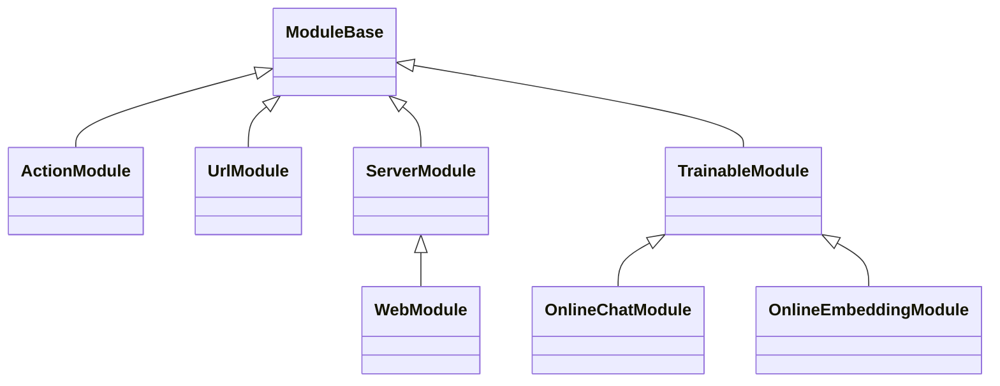

Sources: [lazyllm/module/module.py]()

## 组件体系结构

### 组件能力

组件是LazyLLM中最小的执行单元，具备以下核心能力：

1. **跨平台执行**：通过launcher实现用户无感的跨平台执行
   - EmptyLauncher：本地运行，支持开发机、裸金属等
   - RemoteLauncher：调度到计算节点运行，支持Slurm、SenseCore等

2. **注册机制**：实现方法的分组索引和快速查找
   - 支持对函数和bash命令进行注册

Sources: [lazyllm/components/core.py]()

### 组件示例

```python
import lazyllm
lazyllm.component_register.new_group('demo')

@lazyllm.component_register('demo')
def test(input):
    return f'input is {input}'

@lazyllm.component_register.cmd('demo')
def test_cmd(input):
    return f'echo input is {input}'
```

使用示例：
```python
# >>> lazyllm.demo.test()(1)
# 'input is 1'
# >>> lazyllm.demo.test_cmd(launcher=launchers.slurm)(2)
# Command: srun -p pat_rd -N 1 --job-name=xf488db3 -n1 bash -c 'echo input is 2'
```

Sources: [lazyllm/components/core.py:10-30]()

## 模块与组件交互

### 模块调用组件

模块通过组合多个组件来实现复杂功能，以下是一个部署组件的示例：

```python
class LazyLLMDeployBase(ComponentBase):
    keys_name_handle = None
    message_format = None
    default_headers = {'Content-Type': 'application/json'}
    stream_url_suffix = ''
    stream_parse_parameters = {}

    encoder_map = dict(image=image_to_base64, audio=audio_to_base64, ocr_files=None)

    @staticmethod
    def extract_result(output, inputs):
        return output

    def __init__(self, *, launcher=launchers.remote()):
        super().__init__(launcher=launcher)
```

Sources: [lazyllm/components/deploy/base.py]()

### 组件调用模块

组件也可以调用模块，以下是一个Embedding组件的示例：

```python
class AbstractEmbedding(ABC):
    def __init__(self, base_embed, source=None, init=False):
        from ..utils.downloader import ModelManager
        self._source = source or lazyllm.config['model_source']
        self._base_embed = ModelManager(self._source).download(base_embed) or ''
        self._embed = None
        self._init = lazyllm.once_flag()
        if init:
            lazyllm.call_once(self._init, self.load_embed)

    @abstractmethod
    def load_embed(self) -> None:
        pass

    @abstractmethod
    def _call(self, data: Dict[str, Union[str, List[str]]]) -> str:
        pass

    def __call__(self, data: Dict[str, Union[str, List[str]]]) -> str:
        lazyllm.call_once(self._init, self.load_embed)
        return self._call(data)
```

Sources: [lazyllm/components/deploy/embed.py]()

## 模块与组件协作流程

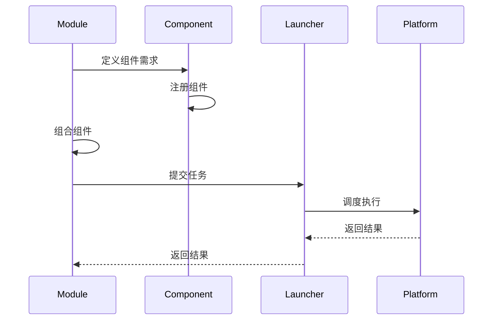

Sources: [lazyllm/components/core.py](), [lazyllm/components/deploy/base.py]()

## 模块与组件关系总结

LazyLLM通过模块与组件的协同工作，实现了系统的灵活性和可扩展性。模块作为顶层组件，通过组合多个组件来实现复杂功能；组件作为最小执行单元，通过注册机制实现方法的分组索引和快速查找。这种设计使得系统既保持了良好的架构清晰度，又实现了强大的功能扩展能力。

Sources: [lazyllm/module/module.py](), [lazyllm/components/core.py](), [lazyllm/components/deploy/base.py](), [lazyllm/components/deploy/embed.py](), [lazyllm/components/utils/file_operate.py]()

---

<a id='page-5'></a>

## 流程构建（Flow）

### Related Pages

Related topics: [RAG 支持](#page-6), [模块与组件关系](#page-4)

<details>
<summary>Relevant source files</summary>

The following files were used as context for generating this wiki page:

- [lazyllm/flow/flow.py](https://github.com/LazyAGI/LazyLLM/blob/main/lazyllm/flow/flow.py)
- [examples/rag.py](https://github.com/LazyAGI/LazyLLM/blob/main/examples/rag.py)
- [examples/story.py](https://github.com/LazyAGI/LazyLLM/blob/main/examples/story.py)
- [lazyllm/__init__.py](https://github.com/LazyAGI/LazyLLM/blob/main/lazyllm/__init__.py)
- [lazyllm/engine/engine.py](https://github.com/LazyAGI/LazyLLM/blob/main/lazyllm/engine/engine.py)
</details>

# 流程构建（Flow）

## 简介

LazyLLM中的流程构建（Flow）是一种定义数据流的机制，描述了数据如何从一个可调用对象传递到另一个可调用对象。通过Flow，用户可以直观而高效地组织和管理数据流动。Flow的设计使得添加新功能变得简单，不同模块甚至项目之间的协作也变得更加容易。

Flow是LazyLLM框架的核心组件之一，它通过标准化的接口和数据流机制减少了开发人员在处理数据传递和转换时的重复工作。通过Flow，开发人员可以将更多精力集中在核心业务逻辑上，从而提高整体开发效率。

## Flow类型

LazyLLM提供了多种类型的Flow，包括Pipeline、Parallel、Diverter、Warp、IFS、Loop等，几乎可以覆盖全部的应用场景。这些Flow支持异步处理模式和并行执行，在处理大规模数据或复杂任务时，可以显著提高响应速度和系统性能。

### Pipeline

Pipeline是一种顺序执行的Flow，数据按照预定义的顺序依次通过各个节点。这种Flow适用于需要按步骤处理数据的场景。

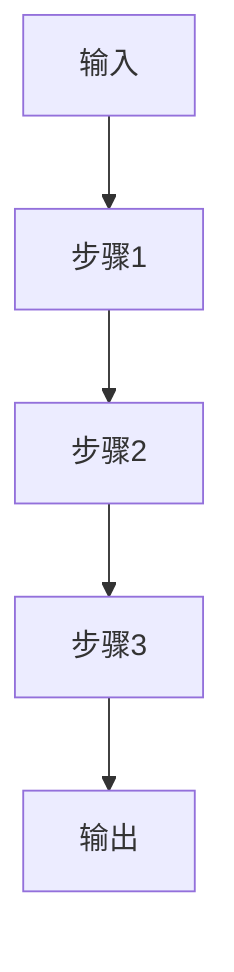

Sources: [lazyllm/flow/flow.py]()

### Parallel

Parallel是一种并行执行的Flow，数据可以同时通过多个分支进行处理。这种Flow适用于需要并行处理多个任务的场景。

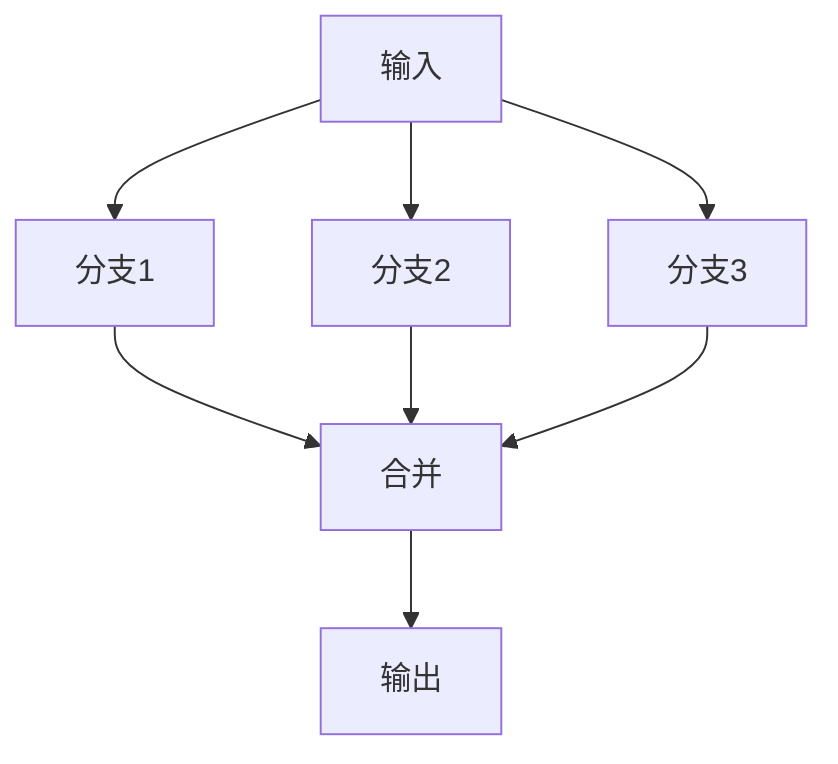

Sources: [lazyllm/flow/flow.py]()

## Flow架构

Flow的架构设计非常灵活，允许用户通过组合不同的Flow来构建复杂的应用程序。Flow的实现基于Python的类继承机制，通过继承FlowBase类来实现不同的Flow类型。

### FlowBase

FlowBase是所有Flow类型的基类，它定义了Flow的基本接口和实现。FlowBase类提供了id、is_root、ancestor等属性，以及for_each等方法。

```python
class FlowBase:
    def __getattr__(self, name):
        if '_item_names' in self.__dict__ and name in self._item_names:
            return self._items[self._item_names.index(name)]
        raise AttributeError(f'{self.__class__} object has no attribute {name}')

    def id(self, module=None):
        if isinstance(module, str): return module
        return self._item_ids[self._items.index(module)] if module else self._flow_id

    @property
    def is_root(self):
        return self._father is None

    @property
    def ancestor(self):
        if self.is_root: return self
        return self._father.ancestor

    def for_each(self, filter, action):
        for item in self._items:
            if isinstance(item, FlowBase):
                item.for_each(filter, action)
            elif filter(item):
                action(item)
```

Sources: [lazyllm/flow/flow.py]()

## Flow使用示例

### 检索增强生成（RAG）

以下是一个使用Flow构建的检索增强生成（RAG）应用示例：

```python
documents = Document(dataset_path="file/to/yourpath", embed=OnlineEmbeddingModule(), manager=False)
documents.create_node_group(name="sentences", transform=SentenceSplitter, chunk_size=1024, chunk_overlap=100)
with pipeline() as ppl:
    with parallel().sum as ppl.prl:
        ppl.prl.retriever1 = Retriever(documents, group_name="sentences", similarity="cosine", topk=3)
        ppl.prl.retriever2 = Retriever(documents, "CoarseChunk", "bm25_chinese", 0.003, topk=3)

    ppl.reranker = Reranker("ModuleReranker", model="bge-reranker-large", topk=1) | bind(query=ppl.input)
    ppl.formatter = (lambda nodes, query: dict(context_str="".join([node.get_content() for node in nodes]), query=query)) | bind(query=ppl.input)
    ppl.llm = OnlineChatModule(stream=False).prompt(ChatPrompter(prompt, extra_keys=["context_str"]))

WebModule(ppl, port=23466).start().wait()
```

Sources: [examples/rag.py]()

### 故事创作

以下是一个使用Flow构建的故事创作应用示例：

```python
from lazyllm import pipeline, warp, bind
from lazyllm.components.formatter import JsonFormatter

toc_prompt = """..."""

def generate_toc(input):
    # 实现生成目录的逻辑
    pass

def generate_chapter(input):
    # 实现生成章节内容的逻辑
    pass

with pipeline() as ppl:
    ppl.toc = generate_toc
    ppl.chapter = generate_chapter

story = ActionModule(ppl)
story.start()
query = "我的妈妈"
res = story(query)
assert type(res) is str
assert len(res) >= 1024
```

Sources: [examples/story.py]()

## Flow优势

1. **模块化设计**：Flow的设计使得添加新功能变得简单，不同模块甚至项目之间的协作也变得更加容易。
2. **减少重复工作**：通过一套标准化的接口和数据流机制，Flow减少了开发人员在处理数据传递和转换时的重复工作。
3. **支持异步和并行处理**：部分Flow支持异步处理模式和并行执行，在处理大规模数据或复杂任务时，可以显著提高响应速度和系统性能。

## 总结

LazyLLM中的流程构建（Flow）是一种强大的机制，通过它可以直观而高效地组织和管理数据流动。Flow的设计使得添加新功能变得简单，不同模块甚至项目之间的协作也变得更加容易。通过Flow，开发人员可以将更多精力集中在核心业务逻辑上，从而提高整体开发效率。LazyLLM提供的多种Flow类型，如Pipeline、Parallel等，几乎可以覆盖全部的应用场景，支持异步处理模式和并行执行，显著提高了处理大规模数据或复杂任务时的响应速度和系统性能。

---

<a id='page-6'></a>

## RAG 支持

### Related Pages

Related topics: [流程构建（Flow）](#page-5), [模型微调与部署](#page-7)

<details>
<summary>Relevant source files</summary>
The following files were used as context for generating this wiki page:

- [lazyllm/tools/rag/component/bm25.py](https://github.com/LazyAGI/LazyLLM/blob/main/lazyllm/tools/rag/component/bm25.py)
- [lazyllm/tools/rag/retriever.py](https://github.com/LazyAGI/LazyLLM/blob/main/lazyllm/tools/rag/retriever.py)
- [lazyllm/tools/rag/document.py](https://github.com/LazyAGI/LazyLLM/blob/main/lazyllm/tools/rag/document.py)
- [lazyllm/tools/rag/store.py](https://github.com/LazyAGI/LazyLLM/blob/main/lazyllm/tools/rag/store.py)
- [lazyllm/tools/rag/similarity.py](https://github.com/LazyAGI/LazyLLM/blob/main/lazyllm/tools/rag/similarity.py)
</details>

# RAG 支持

## 简介

LazyLLM 提供了强大的 RAG（Retrieval-Augmented Generation，检索增强生成）支持，允许开发者构建高效的知识增强型 AI 应用。RAG 模块的核心功能包括文档加载、内容分块、向量化存储、多策略检索、排序融合等，这些功能通过模块化设计实现灵活组合，支持本地和在线模型部署。

RAG 支持主要由 `Document`、`Retriever`、`BM25`、`Reranker` 等核心组件构成，开发者可通过声明式 API 快速构建检索流程，并通过 `pipeline` 和 `parallel` 构建复杂的检索-排序-生成流程。该系统支持多种索引类型（如 Milvus、Map、FAISS）、多语言检索（包括中文 BM25）、多模型嵌入（multi-embedding）及多策略融合排序（如 RRF）。

Sources: [lazyllm/tools/rag/document.py](), [lazyllm/tools/rag/retriever.py](), [lazyllm/tools/rag/component/bm25.py]()

## 架构概览

RAG 系统的整体架构如下所示：

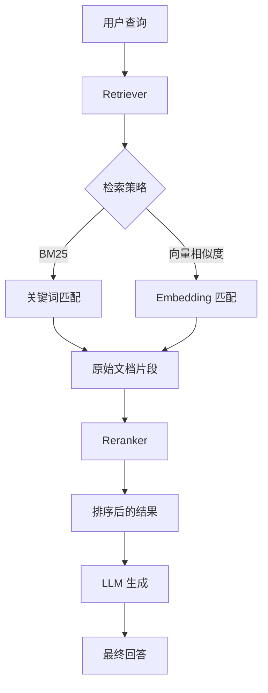

Sources: [lazyllm/tools/rag/retriever.py](), [lazyllm/tools/rag/component/bm25.py]()

## 核心组件详解

### Document

`Document` 是 RAG 系统的核心数据管理组件，负责文档的加载、分块、嵌入向量生成与存储。它支持多种数据源（本地文件、URL）和多种文档格式（文本、PDF、Word 等），并可通过 `create_node_group` 方法定义不同的分块策略。

关键功能包括：

- 多文档格式支持
- 多嵌入模型支持（multi-embedding）
- 自定义分块策略（如 SentenceSplitter）
- 持久化存储（支持 Milvus、Map 等）

```python
doc = Document(dataset_path="rag_master", embed={"m1": embed_model1, "m2": embed_model2})
doc.create_node_group(name="sentences", transform=SentenceSplitter, chunk_size=1024, chunk_overlap=100)
```

Sources: [lazyllm/tools/rag/document.py](), [lazyllm/tools/rag/store.py]()

### Retriever

`Retriever` 是负责从 `Document` 中检索相关文档片段的组件。它支持多种检索策略，包括基于关键词的 BM25 检索和基于向量相似度的检索（如 cosine 相似度）。

关键参数包括：

- `doc`: 要检索的文档对象
- `group_name`: 要检索的节点组名
- `similarity`: 检索策略（如 "cosine", "bm25", "bm25_chinese"）
- `topk`: 返回的 top-k 个结果
- `similarity_cut_off`: 相似度阈值过滤

```python
retriever = Retriever(doc, group_name="sentences", similarity="cosine", topk=10)
```

Sources: [lazyllm/tools/rag/retriever.py](), [lazyllm/tools/rag/similarity.py]()

### BM25

`BM25` 是基于 TF-IDF 的关键词检索算法，支持中英文检索。对于中文检索，使用 `jieba` 分词并结合中文停用词过滤，支持自定义分词器和词干提取器。

```python
bm25 = BM25(nodes, language="zh", topk=2)
```

其检索流程如下：

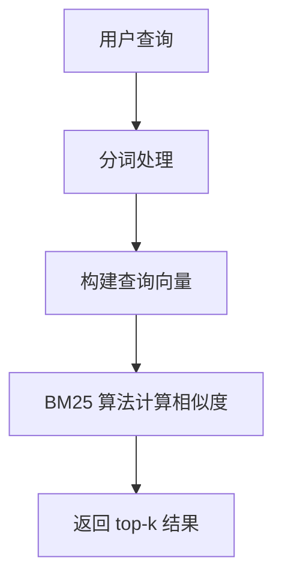

Sources: [lazyllm/tools/rag/component/bm25.py](), [lazyllm/tools/rag/retriever.py]()

### Reranker

`Reranker` 是用于对多个检索结果进行重新排序的组件，通常用于融合不同检索策略的结果。支持模块化排序器（如 `ModuleReranker`）和基于模型的排序（如 `bge-reranker-large`）。

```python
reranker = Reranker("ModuleReranker", model="bge-reranker-large", topk=1)
```

排序流程如下：

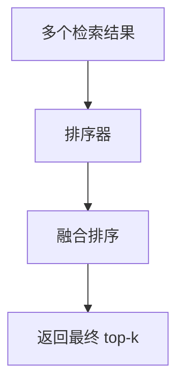

Sources: [lazyllm/tools/rag/retriever.py](), [lazyllm/tools/rag/reranker.py]()

## 检索流程示例

一个典型的 RAG 检索流程如下所示：

```python
with pipeline() as ppl:
    with parallel().sum as ppl.prl:
        ppl.prl.retriever1 = Retriever(doc, group_name="sentences", similarity="cosine", topk=3)
        ppl.prl.retriever2 = Retriever(doc, "CoarseChunk", "bm25_chinese", 0.003, topk=3)

    ppl.reranker = Reranker("ModuleReranker", model="bge-reranker-large", topk=1) | bind(query=ppl.input)
    ppl.formatter = (lambda nodes, query: dict(context_str="".join([node.get_content() for node in nodes]), query=query)) | bind(query=ppl.input)
    ppl.llm = lazyllm.TrainableModule("internlm2-chat-7b").prompt(...)
```

该流程执行以下步骤：

1. 并行执行多个检索器（基于向量相似度和 BM25）
2. 对结果进行融合排序（Reranker）
3. 格式化上下文并输入 LLM 生成最终回答

Sources: [lazyllm/tools/rag/retriever.py](), [lazyllm/tools/rag/component/bm25.py](), [lazyllm/tools/rag/reranker.py]()

## 持久化与存储

LazyLLM 的 RAG 支持多种存储后端，包括 Milvus、Map（内存映射）等。通过 `store_conf` 参数可配置存储类型和索引策略。

示例配置：

```python
milvus_store_conf = {
    'type': 'milvus',
    'kwargs': {
        'uri': tmp_dir.store_file,
        'index_kwargs': {
            'index_type': 'HNSW',
            'metric_type': 'COSINE',
        }
    },
}
```

支持的存储类型：

| 存储类型 | 描述 | 特点 |
|---------|------|------|
| Milvus  | 向量数据库 | 支持高效向量检索，适合大规模数据 |
| Map     | 内存映射 | 适合小规模数据，轻量级 |
| FAISS   | 向量索引库 | 高性能，支持多种索引结构 |

Sources: [lazyllm/tools/rag/store.py](), [lazyllm/tools/rag/document.py]()

## 总结

LazyLLM 的 RAG 支持通过模块化设计实现了灵活、高效的知识增强型 AI 应用开发。其核心组件包括 `Document`、`Retriever`、`BM25`、`Reranker` 等，支持多种检索策略、多模型嵌入、多策略融合排序，并可通过 `pipeline` 和 `parallel` 构建复杂流程。此外，系统还支持多种存储后端，便于根据应用场景选择合适的持久化方案。

---

<a id='page-7'></a>

## 模型微调与部署

### Related Pages

Related topics: [RAG 支持](#page-6), [本地模型支持](#page-8)

<details>
<summary>Relevant source files</summary>

- [lazyllm/components/finetune/base.py](https://github.com/LazyAGI/LazyLLM/blob/main/lazyllm/components/finetune/base.py)
- [lazyllm/components/deploy/base.py](https://github.com/LazyAGI/LazyLLM/blob/main/lazyllm/components/deploy/base.py)
- [lazyllm/components/deploy/vllm.py](https://github.com/LazyAGI/LazyLLM/blob/main/lazyllm/components/deploy/vllm.py)
- [lazyllm/module/llms/trainablemodule.py](https://github.com/LazyAGI/LazyLLM/blob/main/lazyllm/module/llms/trainablemodule.py)
- [lazyllm/components/auto/autofinetune.py](https://github.com/LazyAGI/LazyLLM/blob/main/lazyllm/components/auto/autofinetune.py)
</details>

# 模型微调与部署

## 简介

LazyLLM 提供了一套完整的模型微调（Fine-tuning）与部署（Deployment）解决方案，支持开发者在不同场景下对模型进行训练和部署。该系统基于模块化设计，允许用户灵活选择不同的微调框架和部署引擎。核心功能包括：

- 模型微调：支持 LoRA 等参数高效微调方法，提供统一接口封装不同训练框架（如 EasyLLM、DeepSpeed 等）。
- 模型部署：支持多种部署方式（如 vLLM、LightLLM、AutoDeploy 等），并提供统一的 API 接口调用模型服务。
- 自动化配置：通过 `AutoConfig` 和 `AutoFinetune` 实现自动选择最优训练和部署参数。

LazyLLM 的微调与部署模块与 [模型管理](#)、[推理服务](#) 等模块高度集成，构成了完整的模型开发与应用流水线。

## 架构与组件

### 核心组件结构

LazyLLM 的模型微调与部署模块由多个核心组件构成，包括：

- **`LazyLLMFinetuneBase`**：微调模块基类，提供统一的训练接口。
- **`LazyLLMDeployBase`**：部署模块基类，定义通用的部署行为。
- **`AutoFinetune`**：自动选择最佳微调配置和框架。
- **`TrainableModule`**：整合微调与部署逻辑的高层模块。
- **`vLLMDeploy`**：基于 vLLM 的部署实现。

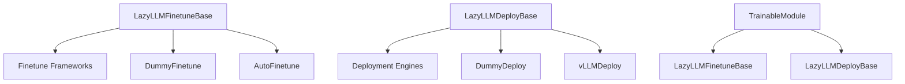

Sources: [lazyllm/components/finetune/base.py](https://github.com/LazyAGI/LazyLLM/blob/main/lazyllm/components/finetune/base.py), [lazyllm/components/deploy/base.py](https://github.com/LazyAGI/LazyLLM/blob/main/lazyllm/components/deploy/base.py), [lazyllm/module/llms/trainablemodule.py](https://github.com/LazyAGI/LazyLLM/blob/main/lazyllm/module/llms/trainablemodule.py), [lazyllm/components/deploy/vllm.py](https://github.com/LazyAGI/LazyLLM/blob/main/lazyllm/components/deploy/vllm.py), [lazyllm/components/auto/autofinetune.py](https://github.com/LazyAGI/LazyLLM/blob/main/lazyllm/components/auto/autofinetune.py)

### 微调模块（Finetune）

LazyLLM 的微调模块提供统一接口，封装了多种训练框架的实现细节。其核心是 `LazyLLMFinetuneBase` 类，该类定义了 `cmd` 接口供子类实现具体的训练命令。

```python
class LazyLLMFinetuneBase(ComponentBase):
    __reg_overwrite__ = 'cmd'

    def __init__(self, base_model, target_path, *, launcher=launchers.remote()):
        super().__init__(launcher=launcher)
        self.base_model = base_model
        self.target_path = target_path
        self.merge_path = None

    def __call__(self, *args, **kw):
        super().__call__(*args, **kw)
        if self.merge_path:
            return self.merge_path
        else:
            return self.target_path
```

LazyLLM 支持多种微调框架，如 `EasyLLM`、`DeepSpeed` 等，并通过 `AutoFinetune` 实现自动配置选择。

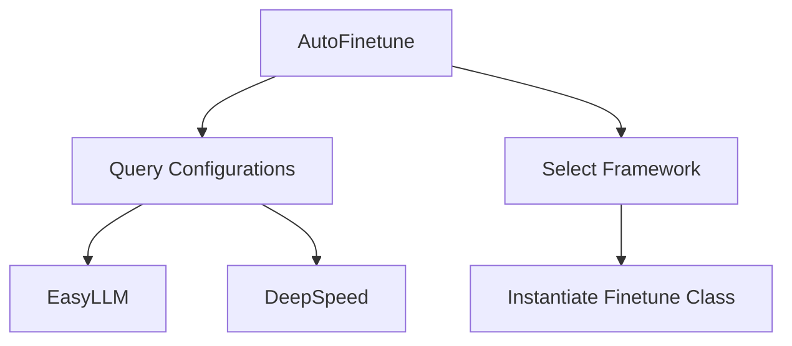

Sources: [lazyllm/components/finetune/base.py](https://github.com/LazyAGI/LazyLLM/blob/main/lazyllm/components/finetune/base.py), [lazyllm/components/auto/autofinetune.py](https://github.com/LazyAGI/LazyLLM/blob/main/lazyllm/components/auto/autofinetune.py)

### 部署模块（Deployment）

LazyLLM 的部署模块提供统一的 API 接口，支持多种部署引擎，如 `vLLM`、`LightLLM`、`AutoDeploy` 等。其核心是 `LazyLLMDeployBase` 类，该类定义了 `keys_name_handle`、`message_format` 等通用部署参数。

```python
class LazyLLMDeployBase(ComponentBase):
    keys_name_handle = None
    message_format = None
    default_headers = {'Content-Type': 'application/json'}
    stream_url_suffix = ''
    stream_parse_parameters = {}

    encoder_map = dict(image=image_to_base64, audio=audio_to_base64, ocr_files=None)

    @staticmethod
    def extract_result(output, inputs):
        return output

    def __init__(self, *, launcher=launchers.remote()):
        super().__init__(launcher=launcher)
```

部署流程如下：

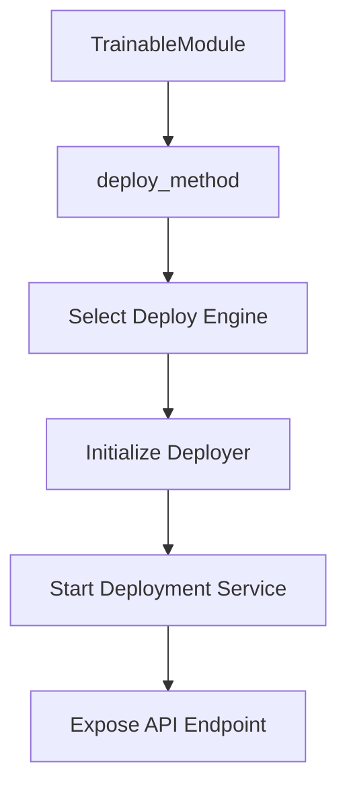

Sources: [lazyllm/components/deploy/base.py](https://github.com/LazyAGI/LazyLLM/blob/main/lazyllm/components/deploy/base.py), [lazyllm/components/deploy/vllm.py](https://github.com/LazyAGI/LazyLLM/blob/main/lazyllm/components/deploy/vllm.py)

## 配置与参数

### 微调配置

LazyLLM 提供 `AutoConfig` 类用于自动选择最优微调配置。其配置文件包括 `finetune.csv` 和 `deploy.csv`，分别用于训练和部署参数。

```python
def query_finetune(self, gpu_type: str, gpu_num: int, model_name: str,
                   ctx_len: int, batch_size: int, lora_r: int):
    return self._query(clazz=TrainingConfiguration, gpu_type=gpu_type, gpu_num=gpu_num, model_name=model_name,
                       ctx_len=ctx_len, batch_size=batch_size, lora_r=lora_r)
```

| 参数 | 类型 | 描述 |
|------|------|------|
| `gpu_type` | `str` | GPU 类型（如 A100） |
| `gpu_num` | `int` | GPU 数量 |
| `model_name` | `str` | 模型名称（如 LLAMA_7B） |
| `ctx_len` | `int` | 上下文长度 |
| `batch_size` | `int` | 批量大小 |
| `lora_r` | `int` | LoRA 参数 r |

Sources: [lazyllm/components/auto/configure/core/configuration.py](https://github.com/LazyAGI/LazyLLM/blob/main/lazyllm/components/auto/configure/core/configuration.py), [lazyllm/components/auto/autofinetune.py](https://github.com/LazyAGI/LazyLLM/blob/main/lazyllm/components/auto/autofinetune.py)

### 部署配置

部署配置通过 `AutoConfig.query_deploy` 接口查询，参数包括：

| 参数 | 类型 | 描述 |
|------|------|------|
| `gpu_type` | `str` | GPU 类型 |
| `gpu_num` | `int` | GPU 数量 |
| `model_name` | `str` | 模型名称 |
| `max_token_num` | `int` | 最大 token 数量 |

```python
def query_deploy(self, gpu_type: str, gpu_num: int, model_name: str, max_token_num):
    return self._query(clazz=DeployConfiguration, gpu_type=gpu_type, gpu_num=gpu_num,
                       model_name=model_name, max_token_num=max_token_num)
```

Sources: [lazyllm/components/auto/configure/core/configuration.py](https://github.com/LazyAGI/LazyLLM/blob/main/lazyllm/components/auto/configure/core/configuration.py), [lazyllm/components/deploy/vllm.py](https://github.com/LazyAGI/LazyLLM/blob/main/lazyllm/components/deploy/vllm.py)

## 微调与部署流程

### 微调流程

LazyLLM 的微调流程如下：

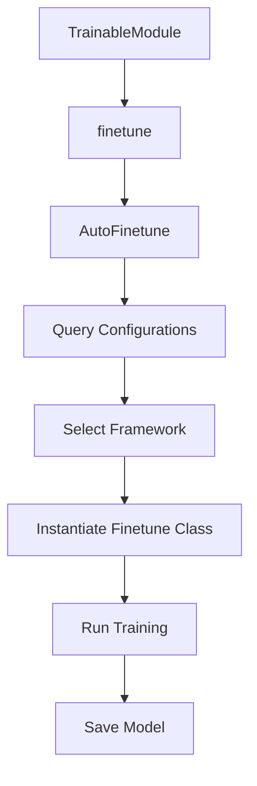

Sources: [lazyllm/components/auto/autofinetune.py](https://github.com/LazyAGI/LazyLLM/blob/main/lazyllm/components/auto/autofinetune.py), [lazyllm/module/llms/trainablemodule.py](https://github.com/LazyAGI/LazyLLM/blob/main/lazyllm/module/llms/trainablemodule.py)

### 部署流程

LazyLLM 的部署流程如下：

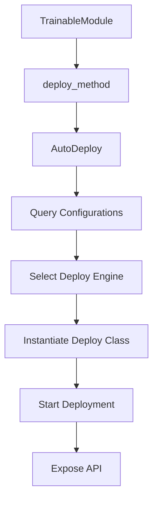

Sources: [lazyllm/module/llms/trainablemodule.py](https://github.com/LazyAGI/LazyLLM/blob/main/lazyllm/module/llms/trainablemodule.py), [lazyllm/components/deploy/vllm.py](https://github.com/LazyAGI/LazyLLM/blob/main/lazyllm/components/deploy/vllm.py)

## 总结

LazyLLM 提供了完整的模型微调与部署解决方案，通过模块化设计实现了高度可扩展性和灵活性。开发者可以基于统一接口选择不同的训练框架和部署引擎，同时通过 `AutoConfig` 实现自动化配置选择。整个系统与模型管理、推理服务等模块深度集成，构建了一个完整的 LLM 应用开发与部署流水线。

---

<a id='page-8'></a>

## 本地模型支持

### Related Pages

Related topics: [模型微调与部署](#page-7), [在线模型支持](#page-9)

<details>
<summary>Relevant source files</summary>
The following files were used as context for generating this wiki page:

- [lazyllm/module/llms/trainablemodule.py](https://github.com/LazyAGI/LazyLLM/blob/main/lazyllm/module/llms/trainablemodule.py)
- [examples/chatbot.py](https://github.com/LazyAGI/LazyLLM/blob/main/examples/chatbot.py)
- [examples/painting.py](https://github.com/LazyAGI/LazyLLM/blob/main/examples/painting.py)
- [lazyllm/components/deploy/base.py](https://github.com/LazyAGI/LazyLLM/blob/main/lazyllm/components/deploy/base.py)
- [lazyllm/cli/run.py](https://github.com/LazyAGI/LazyLLM/blob/main/lazyllm/cli/run.py)
</details>

# 本地模型支持

LazyLLM 提供了完善的本地模型支持，允许开发者在本地环境中部署和运行各种大模型。这种本地支持不仅简化了模型的部署流程，还提供了灵活的配置选项，使得开发者可以根据具体需求选择合适的模型和部署方式。

## 本地模型部署

LazyLLM 的本地模型部署通过 `TrainableModule` 类实现。这个类允许开发者指定模型名称，自动从互联网下载模型，或者从本地路径加载模型。以下是使用 `TrainableModule` 的几种方式：

1. **指定模型名称**：模型将自动从互联网下载。
2. **指定模型名称并设置环境变量**：模型将从指定的本地路径加载。
3. **直接传递绝对路径**：模型将从指定的绝对路径加载。

### 示例代码

```python
import lazyllm
chat = lazyllm.TrainableModule('internlm2-chat-7b')
```

### 部署流程

本地模型的部署流程如下所示：

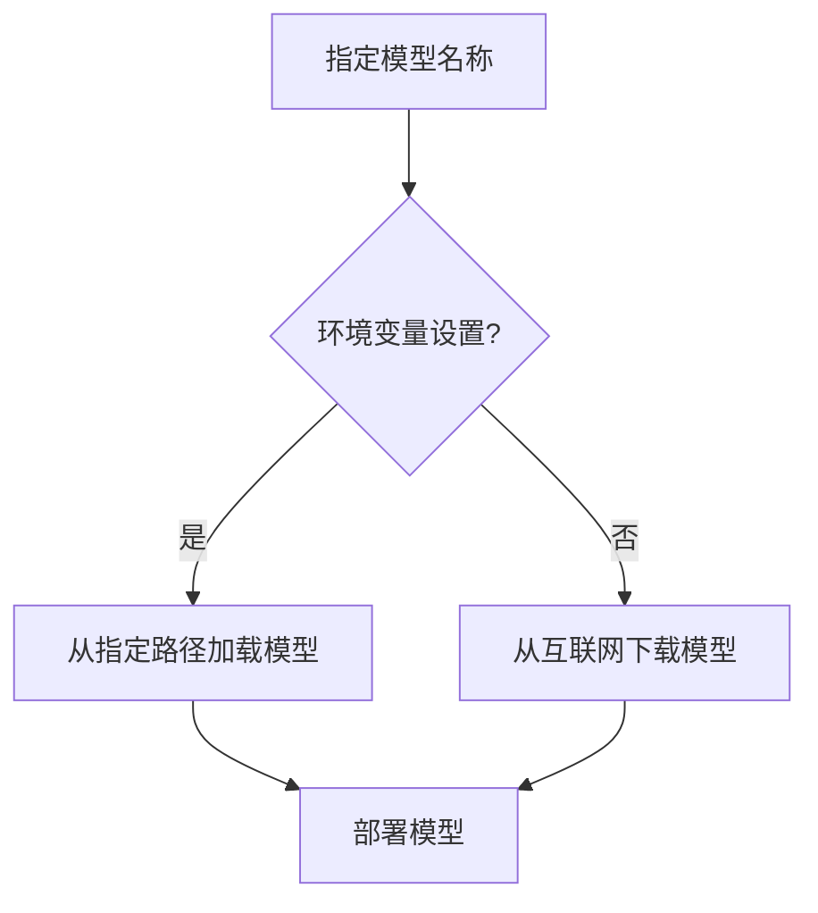

## 本地模型配置

LazyLLM 提供了多种配置选项，允许开发者根据具体需求调整模型的行为。这些配置选项包括模型路径、部署方法等。

### 配置选项

| 配置项 | 类型 | 描述 |
| ---- | ---- | ---- |
| `base_model` | str | 模型名称或路径 |
| `deploy_method` | str | 部署方法，如 `auto`、`local` 等 |
| `url` | str | 可选的部署 URL |

### 示例代码

```python
m = lazyllm.TrainableModule(base_model='bge-large-zh-v1.5').deploy_method(deploy.AutoDeploy)
```

## 本地模型推理

LazyLLM 支持多种本地模型的推理任务，包括文本生成、图像处理、语音识别等。这些任务可以通过简单的 API 调用实现。

### 推理任务示例

```python
res = m('你好')
```

### 推理流程

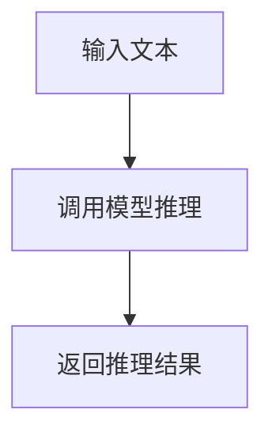

## 本地模型微调

LazyLLM 还支持本地模型的微调，允许开发者根据特定任务对模型进行进一步训练。微调过程可以通过 `AutoFinetune` 类实现。

### 微调配置

| 配置项 | 类型 | 描述 |
| ---- | ---- | ---- |
| `model` | str | 模型名称或路径 |
| `dataset` | str | 数据集路径 |
| `parameters` | dict | 微调参数 |

### 示例代码

```python
from lazyllm.components.finetune import AutoFinetune
finetune = AutoFinetune(model='internlm2-chat-7b', dataset='/path/to/dataset')
```

## 本地模型服务

LazyLLM 提供了本地模型服务，允许开发者通过 Web 接口访问模型。这种服务可以通过 `WebModule` 类实现。

### 服务启动示例

```python
lazyllm.WebModule(chat, port=23466).start().wait()
```

### 服务流程

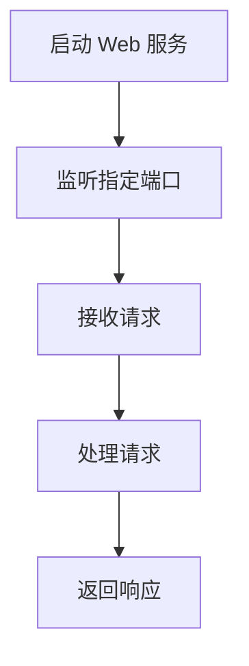

## 结论

LazyLLM 的本地模型支持为开发者提供了一个灵活且强大的工具，使得本地模型的部署、推理、微调和服务变得更加简单和高效。通过这些功能，开发者可以专注于模型的优化和应用的开发，而不必担心底层的实现细节。

---

<a id='page-9'></a>

## 在线模型支持

### Related Pages

Related topics: [本地模型支持](#page-8), [模型微调与部署](#page-7)

<details>
<summary>Relevant source files</summary>

- [lazyllm/module/llms/onlineChatModule/onlineChatModule.py](https://github.com/LazyAGI/LazyLLM/blob/main/lazyllm/module/llms/onlineChatModule/onlineChatModule.py)
- [lazyllm/module/llms/onlineEmbedding/onlineEmbeddingModule.py](https://github.com/LazyAGI/LazyLLM/blob/main/lazyllm/module/llms/onlineEmbedding/onlineEmbeddingModule.py)
- [examples/chatbot_online.py](https://github.com/LazyAGI/LazyLLM/blob/main/examples/chatbot_online.py)
- [lazyllm/module/llms/onlineChatModule/onlineChatModuleBase.py](https://github.com/LazyAGI/LazyLLM/blob/main/lazyllm/module/llms/onlineChatModule/onlineChatModuleBase.py)
- [lazyllm/module/llms/onlineEmbedding/openaiEmbed.py](https://github.com/LazyAGI/LazyLLM/blob/main/lazyllm/module/llms/onlineEmbedding/openaiEmbed.py)
</details>

# 在线模型支持

LazyLLM框架提供对多种在线模型的全面支持，包括聊天模型和嵌入模型。这种支持不仅限于直接调用API，还包括功能扩展、配置管理和模块化设计，使得开发者可以灵活地集成和使用各种在线模型服务。

## 在线聊天模块

在线聊天模块(OnlineChatModule)是LazyLLM框架中用于处理在线聊天模型的核心组件。它通过统一接口封装了多个平台的模型，如OpenAI、GLM、Kimi、SenseNova、Qwen、Doubao和DeepSeek等。

### 架构设计

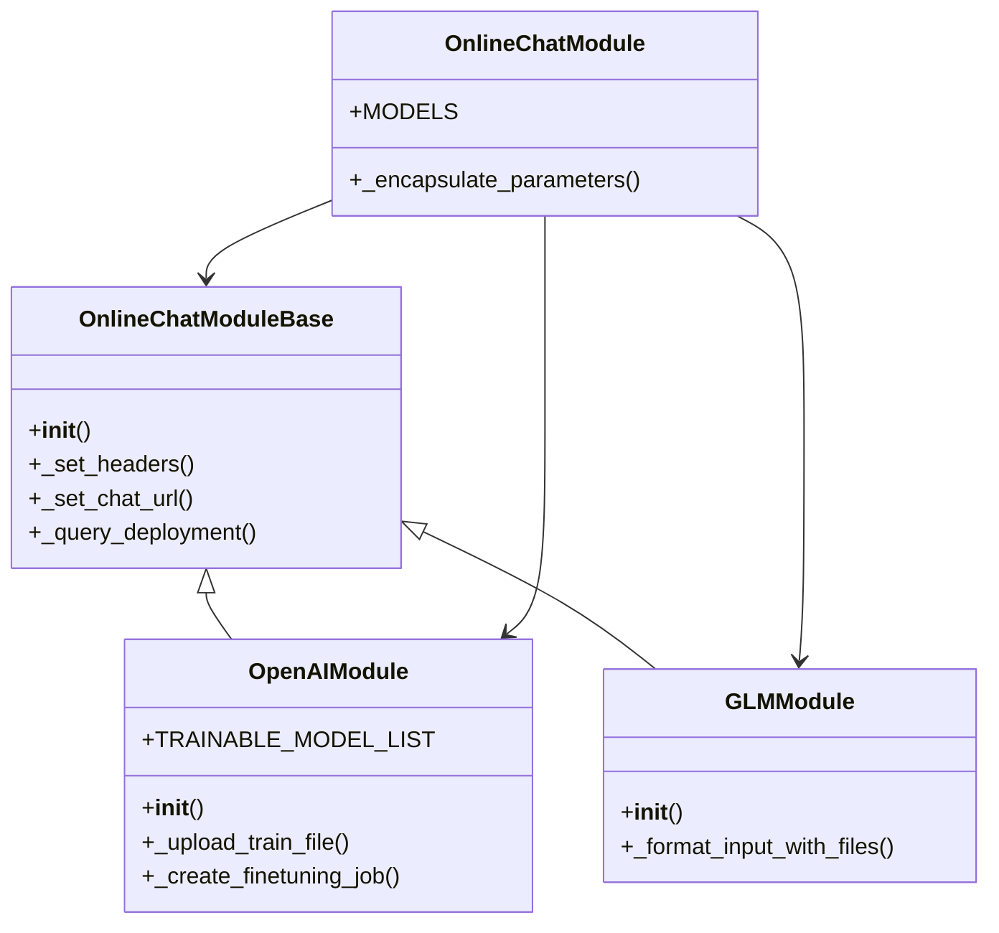

在线聊天模块采用工厂模式设计，通过`MODELS`字典维护可用模型的映射关系。每个具体模型实现都继承自`OnlineChatModuleBase`基类，该基类定义了基础功能如请求头设置、聊天URL设置和部署查询等。

### 关键功能

1. **模型封装**：每个模型通过统一接口封装，保持调用方式一致性
2. **参数封装**：提供`_encapsulate_parameters`方法标准化参数处理
3. **流式传输**：支持流式传输(stream)和非流式传输两种模式
4. **追踪返回**：可选择返回追踪信息(return_trace)

```python
@staticmethod
def _encapsulate_parameters(base_url: str,
                            model: str,
                            stream: bool,
                            return_trace: bool,
                            **kwargs) -> Dict[str, Any]:
    params = {"stream": stream, "return_trace": return_trace}
    if base_url is not None:
        params["base_url"] = base_url
    if model is not None:
        params["model"] = model
    params.update(kwargs)
    return params
```

Sources: [lazyllm/module/llms/onlineChatModule/onlineChatModule.py:25-37]()

## 在线嵌入模块

在线嵌入模块(OnlineEmbeddingModule)负责处理各种在线嵌入模型，支持嵌入和重排序两种模式。

### 架构设计

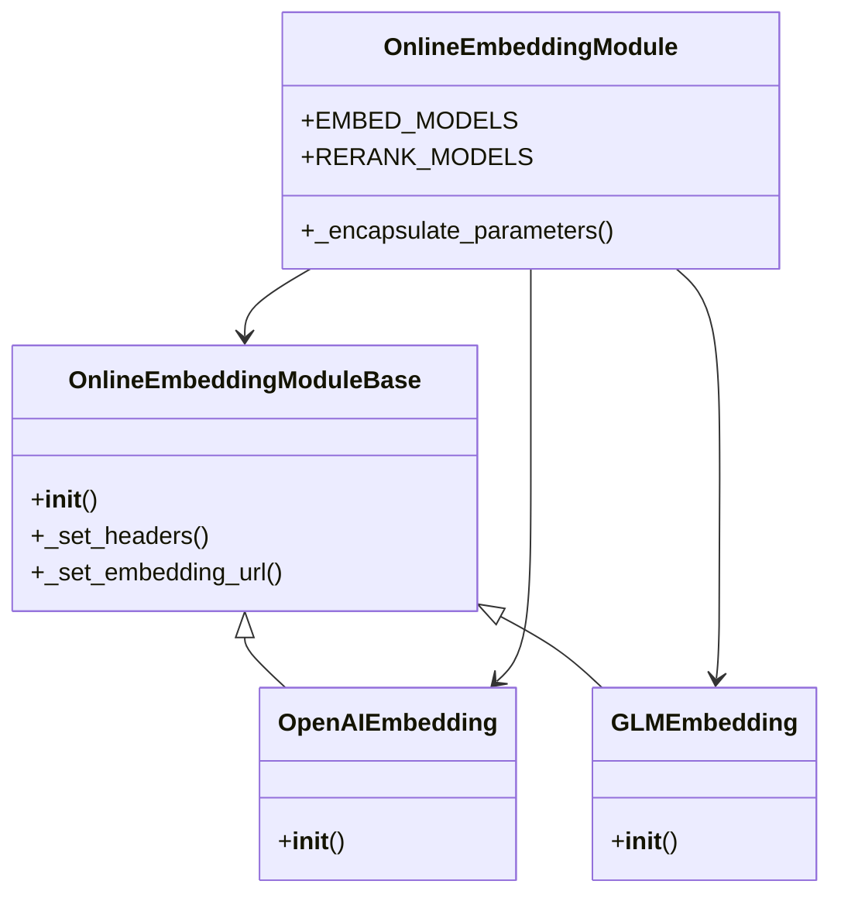

模块采用类似的工厂模式设计，通过`EMBED_MODELS`和`RERANK_MODELS`两个字典分别管理嵌入模型和重排序模型。

### 关键功能

1. **多模式支持**：支持嵌入(embed)和重排序(rerank)两种模式
2. **模型选择**：自动检查可用模型并选择合适的实现
3. **参数封装**：提供统一参数处理方法

```python
def __new__(cls, source: str = None, type: str = "embed", **kwargs):
    if source: source = source.lower()
    params = OnlineEmbeddingModule._encapsulate_parameters(kwargs.get("embed_url"), kwargs.get("embed_model_name"), **kwargs)

    if source is None and "api_key" in kwargs and kwargs["api_key"]:
        raise ValueError("No source is given but an api_key is provided.")

    if "type" in params:
        params.pop("type")
    if kwargs.get("type", "embed") == "embed":
        if source is None:
            source = OnlineEmbeddingModule._check_available_source(OnlineEmbeddingModule.EMBED_MODELS)
        if source == "doubao":
            if kwargs.get("embed_model_name", "").startswith("doubao-embedding-vision"):
                return DoubaoMultimodalEmbedding(**params)
            else:
                return DoubaoEmbedding(**params)
        return OnlineEmbeddingModule.EMBED_MODELS[source](**params)
    elif kwargs.get("type") == "rerank":
        if source is None:
            source = OnlineEmbeddingModule._check_available_source(OnlineEmbeddingModule.RERANK_MODELS)
        return OnlineEmbeddingModule.RERANK_MODELS[source](**params)
    else:
        raise ValueError("Unknown type of online embedding module.")
```

Sources: [lazyllm/module/llms/onlineEmbedding/onlineEmbeddingModule.py:55-84]()

## 配置管理

框架通过配置系统提供灵活的参数管理，支持多种模型的API密钥和模型名称配置。

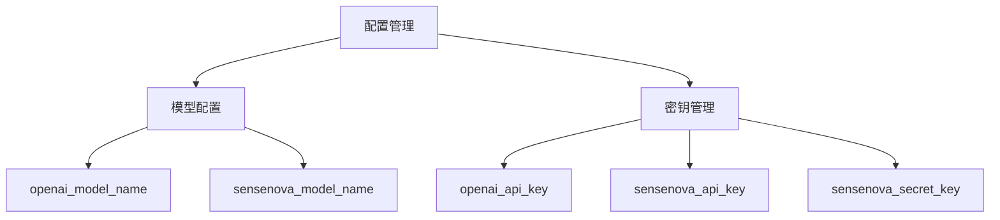

配置系统在初始化时为每个支持的模型添加必要的配置项：

```python
for key in OnlineChatModule.MODELS.keys():
    config.add(f"{key}_api_key", str, "", f"{key.upper()}_API_KEY")
    config.add(f"{key}_model_name", str, "", f"{key.upper()}_MODEL_NAME")

config.add("sensenova_secret_key", str, "", "SENSENOVA_SECRET_KEY")
```

Sources: [lazyllm/module/llms/__init__.py:18-25]()

## 示例应用

框架提供示例代码展示如何使用在线模型，其中`chatbot_online.py`展示了基本的聊天机器人实现。

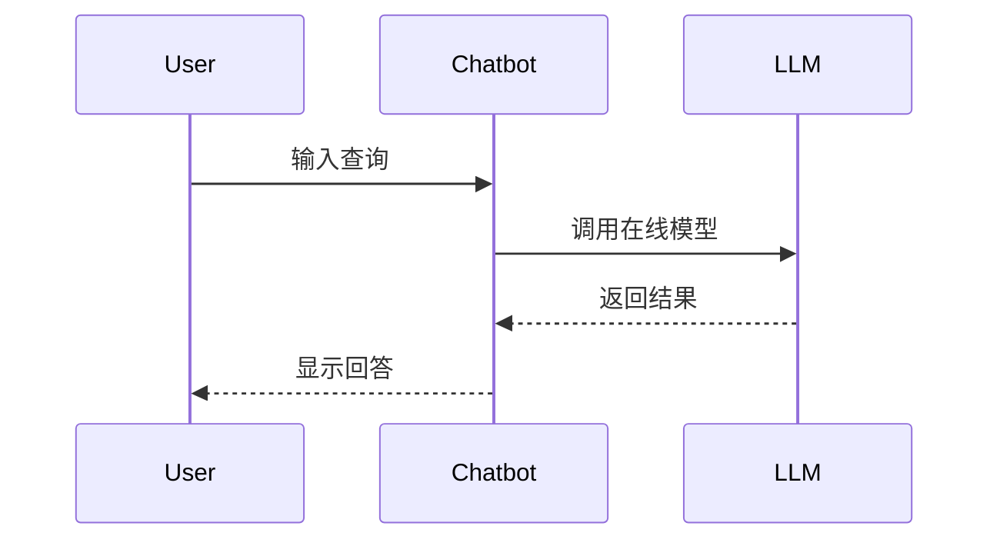

示例代码展示了典型的调用流程：
1. 用户输入查询
2. 聊天机器人调用在线模型
3. 在线模型返回结果
4. 聊天机器人显示回答

Sources: [examples/chatbot_online.py]()

## 支持的模型列表

### 聊天模型

| 模型名称     | 提供商       | 支持功能                  |
|------------|------------|-------------------------|
| OpenAI     | OpenAI     | 基础聊天、流式传输、微调        |
| SenseNova  | 新浪         | 基础聊天、流式传输           |
| GLM        | 智谱AI       | 基础聊天、流式传输、视觉输入处理  |
| Kimi       | 月之暗面     | 基础聊天、流式传输           |
| Qwen       | 阿里云       | 基础聊天、流式传输、重排序     |
| Doubao     | 字节跳动     | 基础聊天、流式传输、多模态嵌入   |
| DeepSeek   | DeepSeek   | 基础聊天、流式传输           |

Sources: [lazyllm/module/llms/onlineChatModule/onlineChatModule.py:12-19]()

### 嵌入模型

| 模型名称     | 提供商       | 支持模式       |
|------------|------------|-------------|
| OpenAI     | OpenAI     | 嵌入          |
| SenseNova  | 新浪         | 嵌入          |
| GLM        | 智谱AI       | 嵌入、重排序     |
| Qwen       | 阿里云       | 嵌入、重排序     |
| Doubao     | 字节跳动     | 嵌入、多模态嵌入   |

Sources: [lazyllm/module/llms/onlineEmbedding/onlineEmbeddingModule.py:20-26]()

## 总结

LazyLLM框架的在线模型支持通过统一的接口和灵活的架构设计，实现了对多种在线模型的高效集成。其核心特点包括：

1. **统一接口**：通过工厂模式和基类设计，为不同模型提供一致的调用方式
2. **功能扩展**：支持流式传输、微调、多模态处理等高级功能
3. **灵活配置**：提供完善的配置管理系统，支持多种模型的API密钥和参数配置
4. **模块化设计**：将聊天和嵌入功能分离为独立模块，提高代码可维护性
5. **丰富支持**：涵盖主流在线模型平台，满足不同场景需求

这种设计使得开发者能够快速集成和切换不同在线模型，同时保持代码的简洁性和可扩展性。

---

<a id='page-10'></a>

## 部署流程

### Related Pages

Related topics: [跨平台支持](#page-11), [快速入门](#page-2)

<details>
<summary>相关源文件</summary>

- [lazyllm/module/webmodule.py](https://github.com/LazyAGI/LazyLLM/blob/main/lazyllm/module/webmodule.py)
- [lazyllm/module/servermodule.py](https://github.com/LazyAGI/LazyLLM/blob/main/lazyllm/module/servermodule.py)
- [examples/rag.py](https://github.com/LazyAGI/LazyLLM/blob/main/examples/rag.py)
- [lazyllm/cli/run.py](https://github.com/LazyAGI/LazyLLM/blob/main/lazyllm/cli/run.py)
- [lazyllm/engine/engine.py](https://github.com/LazyAGI/LazyLLM/blob/main/lazyllm/engine/engine.py)
</details>

# 部署流程

LazyLLM 提供了完整的部署流程支持，涵盖从原型搭建到生产环境部署的全过程。该部署流程通过 `WebModule`、`ServerModule` 等核心组件实现，支持一键部署多模块应用，并提供跨平台兼容性，可无缝迁移至裸金属服务器、Slurm集群、公有云等不同IaaS平台。

部署流程主要分为以下阶段：
1. **模块定义与组装**：使用 `TrainableModule`、`OnlineChatModule` 等模块定义模型和功能组件
2. **流程编排**：通过 `Pipeline`、`Parallel` 等 Flow 组件构建数据流
3. **服务封装**：使用 `ServerModule` 将模块封装为API服务
4. **Web界面部署**：通过 `WebModule` 启动交互式Web服务
5. **跨平台调度**：利用 Launcher 组件实现不同计算平台的无感知调度

## 核心组件

### WebModule

`WebModule` 是 LazyLLM 提供的 Web 界面服务组件，用于启动多轮对话界面服务。它封装了 Gradio 的 Web 界面能力，提供流式输出、音频输入、历史记录等功能。

```python
lazyllm.WebModule(chat, port=23466).start().wait()
```

该组件支持以下关键参数：
- `port`: 指定服务端口，支持范围和单个端口
- `title`: 设置 Web 界面标题
- `audio`: 是否启用音频输入
- `history`: 指定历史记录模块


Sources: [lazyllm/module/webmodule.py]()

### ServerModule

`ServerModule` 是 LazyLLM 提供的服务封装组件，用于将任意函数、Flow 或 Module 包装成 API 服务。它基于 FastAPI 实现，支持 RESTful API 和 WebSocket 接口。

```python
lazyllm.ServerModule(chat).start()
```

该组件实现了以下核心功能：
1. 自动将模块方法转换为 API 端点
2. 提供 OpenAPI 文档界面
3. 支持同步和异步请求处理
4. 实现请求参数验证和错误处理

```mermaid
flowchart TD
    A[Client Request] --> B[FastAPI Server]
    B --> C[Route Handler]
    C --> D[Module Execution]
    D --> E[Result Processing]
    E --> B
    B --> A
```

Sources: [lazyllm/module/servermodule.py]()

### Launcher

Launcher 组件实现了跨平台调度能力，支持本地运行、远程执行、Slurm 集群等多种执行模式。通过 Launcher，开发者可以无感知地在不同计算平台上运行模型和服务。

```python
lazyllm.launcher.EmptyLauncher()  # 本地执行
lazyllm.launcher.RemoteLauncher()  # 远程执行
lazyllm.launcher.SlurmLauncher()  # Slurm 集群
```

Sources: [lazyllm/launcher.py]()

## 部署流程详解

### 1. 模块定义

使用 `TrainableModule` 或 `OnlineChatModule` 定义模型模块，支持本地模型和在线模型：

```python
chat = lazyllm.TrainableModule('internlm2-chat-7b')  # 本地模型
chat = lazyllm.OnlineChatModule()  # 在线模型
```

Sources: [examples/rag.py]()

### 2. 流程编排

通过 `Pipeline` 和 `Parallel` 等 Flow 组件构建数据处理流程：

```python
with pipeline() as ppl:
    with parallel().sum as ppl.prl:
        prl.retriever1 = Retriever(documents, group_name="sentences", similarity="cosine", topk=3)
        prl.retriever2 = Retriever(documents, "CoarseChunk", "bm25_chinese", 0.003, topk=3)
    ppl.reranker = Reranker("ModuleReranker", model="bge-reranker-large", topk=1) | bind(query=ppl.input)
    ppl.formatter = (lambda nodes, query: dict(context_str="".join([node.get_content() for node in nodes]), query=query)) | bind(query=ppl.input)
    ppl.llm = lazyllm.TrainableModule("internlm2-chat-7b").prompt(lazyllm.ChatPrompter(prompt, extra_keys=["context_str"]))
```

Sources: [examples/rag.py]()

### 3. 服务封装

使用 `ServerModule` 将构建好的流程封装为 API 服务：

```python
server = lazyllm.ServerModule(ppl)
server.start()
```

Sources: [lazyllm/module/servermodule.py]()

### 4. Web 界面部署

通过 `WebModule` 启动交互式 Web 服务：

```python
web = lazyllm.WebModule(ppl, port=23456)
web.start().wait()
```

Sources: [lazyllm/module/webmodule.py]()

### 5. 跨平台调度

通过 Launcher 实现不同平台的无感知调度：

```python
# 本地执行
chat = lazyllm.TrainableModule('internlm2-chat-7b', launcher=lazyllm.launcher.EmptyLauncher())

# Slurm 集群执行
chat = lazyllm.TrainableModule('internlm2-chat-7b', launcher=lazyllm.launcher.SlurmLauncher(partition='pat_rd'))
```

Sources: [lazyllm/launcher.py]()

## 部署架构图

```mermaid
flowchart TD
    A[User Interface] --> B(WebModule)
    B --> C[ServerModule]
    C --> D[Flow Processing]
    D --> E[Module Execution]
    E --> F[Model Inference]
    F --> G[Local/Remote Execution]
    G --> H[CPU/GPU Cluster]
    
    subgraph Application Layer
        B
        C
    end
    
    subgraph Processing Layer
        D
        E
    end
    
    subgraph Infrastructure Layer
        F
        G
        H
    end
```

Sources: [lazyllm/module/webmodule.py](), [lazyllm/module/servermodule.py](), [examples/rag.py]()

## 部署配置

LazyLLM 支持多种部署配置选项，主要通过环境变量和配置文件进行设置：

| 配置项 | 描述 | 默认值 | 示例 |
|------|------|-------|------|
| LAZYLLM_OPENAI_API_KEY | OpenAI API 密钥 | 无 | sk-xxxxxxx |
| LAZYLLM_DEBUG | 调试模式开关 | False | True |
| LAZYLLM_PORT | 默认服务端口 | 8000 | 23456 |
| LAZYLLM_LAUNCHER | 默认执行器 | EmptyLauncher | SlurmLauncher |

Sources: [lazyllm/config.py]()

## 部署命令

LazyLLM 提供了便捷的命令行部署工具：

```bash
# 启动对话机器人
lazyllm run chatbot --model=internlm2-chat-7b

# 启动 RAG 应用
lazyllm run rag --documents=/path/to/data --model=internlm2-chat-7b
```

Sources: [lazyllm/cli/run.py]()

## 总结

LazyLLM 的部署流程设计充分考虑了 AI 应用开发的全生命周期需求，从原型搭建到生产部署提供了完整的解决方案。通过模块化设计和统一的接口，实现了以下优势：

1. **快速原型开发**：通过预置模块和 Flow 组件，可快速搭建复杂 AI 应用
2. **无缝平台迁移**：通过 Launcher 组件实现不同计算平台的无感知调度
3. **高效服务部署**：通过 WebModule 和 ServerModule 提供一键部署能力
4. **灵活配置管理**：支持多种配置方式，适应不同部署环境需求

这些特性使得 LazyLLM 的部署流程既能满足快速开发验证的需求，又能支撑生产环境的稳定运行，为 AI 应用开发提供了强大的基础设施支持。

---

<a id='page-11'></a>

## 跨平台支持

### Related Pages

Related topics: [部署流程](#page-10), [模型微调与部署](#page-7)

<details>
<summary>Relevant source files</summary>

The following files were used as context for generating this wiki page:

- [lazyllm/common/launcher.py](https://github.com/LazyAGI/LazyLLM/blob/main/lazyllm/common/launcher.py)
- [lazyllm/components/deploy/relay/base.py](https://github.com/LazyAGI/LazyLLM/blob/main/lazyllm/components/deploy/relay/base.py)
- [tests/advanced_tests/full_test/test_deploy.py](https://github.com/LazyAGI/LazyLLM/blob/main/tests/advanced_tests/full_test/test_deploy.py)
- [lazyllm/components/deploy/base.py](https://github.com/LazyAGI/LazyLLM/blob/main/lazyllm/components/deploy/base.py)
- [lazyllm/module/servermodule.py](https://github.com/LazyAGI/LazyLLM/blob/main/lazyllm/module/servermodule.py)
- [lazyllm/components/auto/autodeploy.py](https://github.com/LazyAGI/LazyLLM/blob/main/lazyllm/components/auto/autodeploy.py)
- [lazyllm/config.py](https://github.com/LazyAGI/LazyLLM/blob/main/lazyllm/config.py)
- [lazyllm/components/deploy/lmdeploy.py](https://github.com/LazyAGI/LazyLLM/blob/main/lazyllm/components/deploy/lmdeploy.py)
- [lazyllm/components/deploy/ray.py](https://github.com/LazyAGI/LazyLLM/blob/main/lazyllm/components/deploy/ray.py)
- [lazyllm/components/deploy/mindie.py](https://github.com/LazyAGI/LazyLLM/blob/main/lazyllm/components/deploy/mindie.py)
</details>

# 跨平台支持

LazyLLM 的跨平台支持机制为开发者提供了在不同算力平台上获得一致使用体验的能力。该项目支持裸金属、Slurm、SenseCore等多种算力平台，并通过统一的接口抽象和适配器模式实现了平台无关性。这种设计使得开发者无需关心底层平台的具体实现细节，可以专注于算法和业务逻辑的开发。

## 架构设计

LazyLLM 的跨平台支持主要通过 Launcher 模块实现，该模块采用策略模式设计，为不同平台提供统一的接口。核心类包括 EmptyLauncher（本地运行）、RemoteLauncher（远程运行）、SlurmLauncher（Slurm 平台）等。

```mermaid
classDiagram
    class LauncherBase {
        <<abstract>>
        +launch(cmd) abstract
        +stop(job_id) abstract
    }

    class EmptyLauncher {
        +launch(cmd)
        +stop(job_id)
    }

    class RemoteLauncher {
        +launch(cmd)
        +stop(job_id)
    }

    class SlurmLauncher {
        +launch(cmd)
        +stop(job_id)
    }

    class SenseCoreLauncher {
        +launch(cmd)
        +stop(job_id)
    }

    LauncherBase <|-- EmptyLauncher
    LauncherBase <|-- RemoteLauncher
    LauncherBase <|-- SlurmLauncher
    LauncherBase <|-- SenseCoreLauncher
```

Sources: [lazyllm/common/launcher.py]()

## 核心组件

### Launcher 抽象基类

所有 Launcher 的实现都继承自 LauncherBase 抽象基类，该类定义了所有 Launcher 必须实现的基本方法：

```python
class LauncherBase:
    def launch(self, cmd):
        raise NotImplementedError

    def stop(self, job_id):
        raise NotImplementedError
```

Sources: [lazyllm/common/launcher.py]()

### EmptyLauncher

EmptyLauncher 用于本地运行，适用于开发机、裸金属等环境：

```python
class EmptyLauncher(LauncherBase):
    def launch(self, cmd):
        # 本地执行命令
        ...

    def stop(self, job_id):
        # 本地停止进程
        ...
```

Sources: [lazyllm/common/launcher.py]()

### RemoteLauncher

RemoteLauncher 用于远程执行任务：

```python
class RemoteLauncher(LauncherBase):
    def __init__(self, host, user, ssh_key):
        # 初始化远程连接参数
        ...

    def launch(self, cmd):
        # 通过 SSH 在远程主机上执行命令
        ...

    def stop(self, job_id):
        # 停止远程主机上的进程
        ...
```

Sources: [lazyllm/common/launcher.py]()

### SlurmLauncher

SlurmLauncher 用于在 Slurm 集群上执行任务：

```python
class SlurmLauncher(LauncherBase):
    def __init__(self, partition, nnode, ngpus, sync):
        # 初始化 Slurm 配置参数
        ...

    def launch(self, cmd):
        # 生成 srun 命令并执行
        ...

    def stop(self, job_id):
        # 使用 scancel 停止作业
        ...
```

Sources: [lazyllm/common/launcher.py]()

## 平台适配

### 配置管理

LazyLLM 通过 config 模块管理不同平台的配置参数：

```python
# 配置 Slurm 平台相关参数
config.add('slurm_default_partition', str, 'default', 'SLURM_DEFAULT_PARTITION')
config.add('slurm_default_nodes', int, 1, 'SLURM_DEFAULT_NODES')
config.add('slurm_default_gpus', int, 1, 'SLURM_DEFAULT_GPUS')
```

Sources: [lazyllm/config.py]()

### 任务调度

LazyLLM 支持多种任务调度方式，包括本地调度、远程调度和集群调度：

```python
# 本地调度示例
launcher = launchers.empty()
launcher.launch("echo 'Hello World'")

# 远程调度示例
launcher = launchers.remote(host="192.168.1.100", user="user", ssh_key="~/.ssh/id_rsa")
launcher.launch("echo 'Hello Remote'")

# Slurm 调度示例
launcher = launchers.slurm(partition="gpu", nnode=2, ngpus=4)
launcher.launch("echo 'Hello Slurm'")
```

Sources: [lazyllm/common/launcher.py]()

## 部署支持

### 部署基础类

LazyLLMDeployBase 是所有部署类的基类，定义了部署的基本接口和默认实现：

```python
class LazyLLMDeployBase(ComponentBase):
    keys_name_handle = None
    message_format = None
    default_headers = {'Content-Type': 'application/json'}
    stream_url_suffix = ''
    stream_parse_parameters = {}

    def __init__(self, *, launcher=launchers.remote()):
        super().__init__(launcher=launcher)
```

Sources: [lazyllm/components/deploy/base.py]()

### RelayServer

RelayServer 是一个基于 FastAPI 的通用服务中继器，支持在不同平台上部署服务：

```python
class RelayServer(LazyLLMDeployBase):
    def __init__(self, port=None, *, func=None, pre_func=None, post_func=None,
                 pythonpath=None, log_path=None, cls=None, launcher=launchers.remote(sync=False)):
        self.func = func
        self.pre = dump_obj(pre_func)
        self.post = dump_obj(post_func)
        self.port, self.real_port = port, None
        self.pythonpath = pythonpath
        super().__init__(launcher=launcher)
```

Sources: [lazyllm/components/deploy/relay/base.py]()

### 平台特定部署

LazyLLM 支持多种平台特定的部署方式，包括：

1. **LMDeploy** - 支持在本地和远程部署大语言模型
2. **Ray** - 支持在 Ray 集群上部署模型
3. **MindIE** - 支持华为 MindIE 平台的模型部署

```mermaid
classDiagram
    class LazyLLMDeployBase {
        <<abstract>>
        +keys_name_handle
        +message_format
        +default_headers
        +extract_result()
    }

    class LMDeploy {
        +keys_name_handle
        +message_format
        +default_headers
        +auto_map
        +stream_parse_parameters
    }

    class RayDistributed {
        +cmd()
        +stop()
    }

    class Mindie {
        +keys_name_handle
        +message_format
        +auto_map
    }

    LazyLLMDeployBase <|-- LMDeploy
    LazyLLMDeployBase <|-- RayDistributed
    LazyLLMDeployBase <|-- Mindie
```

Sources: [lazyllm/components/deploy/lmdeploy.py](), [lazyllm/components/deploy/ray.py](), [lazyllm/components/deploy/mindie.py]()

## 服务模块

### ServerModule

ServerModule 是 LazyLLM 中用于管理服务的核心类，它封装了服务的启动、停止和调用逻辑：

```python
class ServerModule(UrlModule):
    def __init__(self, m: Optional[Union[str, ModuleBase]] = None, pre: Optional[Callable] = None,
                 post: Optional[Callable] = None, stream: Union[bool, Dict] = False,
                 return_trace: bool = False, port: Optional[int] = None, pythonpath: Optional[str] = None,
                 launcher: Optional[LazyLLMLaunchersBase] = None, url: Optional[str] = None):
        # 初始化服务模块
        ...
```

Sources: [lazyllm/module/servermodule.py]()

### 服务生命周期管理

ServerModule 使用 _get_deploy_tasks 方法管理服务的部署任务：

```python
@lazyllm.once_wrapper
def _get_deploy_tasks(self):
    if self._m is None: return None
    return Pipeline(
        lazyllm.deploy.RelayServer(func=self._m, pre_func=self._pre_func, port=self._port,
                                   pythonpath=self._pythonpath, post_func=self._post_func, launcher=self._launcher),
        self._set_url)
```

Sources: [lazyllm/module/servermodule.py]()

## 自动部署

### AutoDeploy

AutoDeploy 类实现了自动选择最适合的部署方式的功能：

```python
class AutoDeploy:
    @staticmethod
    def _get_embed_deployer(launcher, type, kw):
        if type == 'embed':
            return EmbeddingDeploy, launcher or launchers.remote(ngpus=1), kw
        elif type == 'cross_modal_embed':
            return CrossModalEmbeddingDeploy, launcher or launchers.remote(ngpus=1), kw
        elif type == 'reranker':
            return RerankDeploy, launcher or launchers.remote(ngpus=1), kw
```

Sources: [lazyllm/components/auto/autodeploy.py]()

AutoDeploy 根据模型类型自动选择部署方式：

```mermaid
graph TD
    A[AutoDeploy] --> B{模型类型}
    B -->|embed| C[EmbeddingDeploy]
    B -->|cross_modal_embed| D[CrossModalEmbeddingDeploy]
    B -->|reranker| E[RerankDeploy]
    B -->|sd| F[StableDiffusionDeploy]
    B -->|stt| G[SenseVoiceDeploy]
    B -->|tts| H[TTSDeploy]
    B -->|vlm| I[LMDeploy]
    B -->|ocr| J[OCRDeploy]
```

Sources: [lazyllm/components/auto/autodeploy.py]()

## 测试验证

### 部署测试

LazyLLM 提供了全面的测试用例来验证跨平台支持的正确性：

```python
def test_sparse_embedding():
    m = lazyllm.TrainableModule('bge-m3').deploy_method((deploy.AutoDeploy, {'embed_type': 'sparse'}))
    m.update_server()
    res = m('你好')
    assert isinstance(json.loads(res), dict)
    res = m(['你好'])
    assert len(json.loads(res)) == 1
    res = m(['你好', '世界'])
    assert len(json.loads(res)) == 2
```

Sources: [tests/advanced_tests/full_test/test_deploy.py]()

测试覆盖了多种部署场景，包括：

- 稀疏嵌入模型部署
- 跨模态嵌入模型部署
- OCR 服务部署
- 文本到语音服务部署

## 总结

LazyLLM 的跨平台支持机制通过统一的接口抽象和适配器模式实现了平台无关性。核心组件包括 Launcher 模块、RelayServer、ServerModule 和 AutoDeploy 等。这些组件协同工作，为开发者提供了在不同算力平台上一致的使用体验，支持裸金属、Slurm、SenseCore 等多种算力平台。

这种设计使得开发者可以专注于算法和业务逻辑的开发，无需关心底层平台的具体实现细节。同时，LazyLLM 的测试套件确保了跨平台功能的正确性和稳定性。

---

